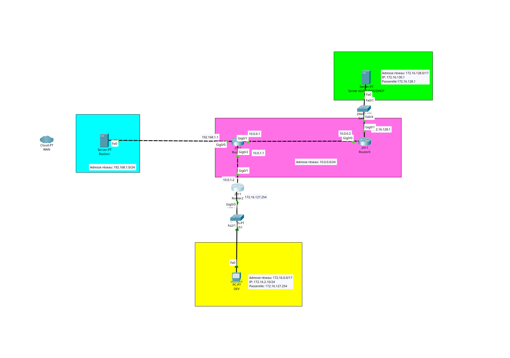

# Sommaire
- [**1. Objectif du document**](#1-objectif-du-document)
- [**2. Vue gérénale de l'architecture réseau**](#2-vue-générale-de-larchitecture-réseau)
- [**3. Schéma réseau**](#3-schéma-réseau)
- [**4. Découpage des VLAN**](#4-découpage-des-vlan)
- [**5.Rôle des principales zones réseau**](#5-rôle-des-principales-zones-réseau)
  - [**5.1 VLAN Utilisateurs**](#51-vlan-utilisateurs)
  - [**5.2 VLAN Serveurs**](#52-vlan-serveurs)
  - [**5.3 VLAN Administration**](#53-vlan-administration)
  - [**5.4 Accès internet**](#54-accès-internet)
  - [**5.5 Bastion**](#55-bastion)
- [**6. Principes de routage**](#6-principes-de-routage)
- [**7. Principes de filtrage réseau**](#7-principes-de-filtrage-réseau)
- [**8. Services réseau prévus**](#8-services-réseau-prévus)
- [**9. Sécurité réseau**](#9-sécurité-réseau)
- [**10. Points restant à compléter**](#10-points-restant-à-compléter)
- [**11. Conclusion**](#11-conclusion)

## 1. Objectif du document

Ce document présente la conception réseau prévue pour l’infrastructure du projet 3.

Il a pour objectif de décrire :
- le découpage réseau logique 
- les VLAN prévus 
- le rôle de chaque zone réseau 
- les principes de communication entre les zones 
- les choix de sécurité réseau retenus.

Cette documentation sera complétée au fur et à mesure de l’avancement du projet.

## 2. Vue générale de l’architecture réseau

L’infrastructure réseau est organisée autour d’une segmentation par VLAN.

Chaque service de l’entreprise dispose de son propre VLAN afin de :
- séparer les flux réseau 
- améliorer la sécurité
- limiter la propagation d’un incident 
- faciliter l’administration 
- appliquer des règles de filtrage adaptées à chaque service.

Un VLAN dédié est également prévu pour les serveurs, un autre pour l’administration, ainsi qu’un accès Internet filtré par un pare-feu.

## 3 Schéma réseau 

Ici, un schéma réseau représentant le VLAN Dev , le VLAN Server AD/DS, DNS et DHCP, ainsi que les routeurs et les switch

## 4. Découpage des VLAN

|VLAN|Nom|Rôle|Plage réseau prévue|
|---|---|---|---|
|VLAN 2|Développement|Réseau des utilisateurs du service développement|172.16.2.0/24|
|VLAN 4|Juridique|Réseau des utilisateurs du service juridique|172.16.4.0/24|
|VLAN 6|Direction / RH / Recrutement|Réseau des utilisateurs de la direction, RH et recrutement|172.16.6.0/24|
|VLAN 8|Commercial|Réseau des utilisateurs du service commercial|172.16.8.0/24|
|VLAN 10|DSI|Réseau des utilisateurs du service informatique|172.16.10.0/24|
|VLAN 12|Comptabilité|Réseau des utilisateurs du service comptabilité|172.16.12.0/24|
|VLAN 14|Communication|Réseau des utilisateurs du service communication|172.16.14.0/24|
|VLAN 100|Serveurs|Réseau des serveurs internes|172.16.100.0/16|
|VLAN 150|Administration|Réseau réservé à l’administration de l’infrastructure|172.16.150.0/16|
|VLAN 200|Stockage|Réseau réservé pour le stockage|172.16.200.0/16|

---

## 5. Rôle des principales zones réseau

### 5.1 VLAN utilisateurs

Les VLAN utilisateurs regroupent les postes clients selon leur service.

Exemples :

- les postes du service développement sont placés dans le VLAN 2 
- les postes du service comptabilité sont placés dans le VLAN 12 
- les postes du service communication sont placés dans le VLAN 14.

Cette organisation permet de limiter les communications inutiles entre services et de mieux contrôler les accès aux ressources.

---

### 5.2 VLAN serveurs

Le VLAN 100 est réservé aux serveurs internes.

Il pourra contenir notamment :

- serveur Active Directory 
- serveur DNS 
- serveur DHCP 
- serveur de fichiers 
- serveur de sauvegarde 
- serveur de supervision.

Ce VLAN doit être protégé car il contient les services essentiels au fonctionnement de l’infrastructure.

---

### 5.3 VLAN administration

Le VLAN 150 est réservé aux tâches d’administration.

Il doit permettre aux administrateurs d’accéder aux équipements et serveurs nécessaires à la gestion de l’infrastructure.

Ce VLAN ne doit pas être utilisé par les utilisateurs standards.

---

### 5.4 Accès Internet

L’accès Internet passe par une zone protégée par un pare-feu.

Le pare-feu permet de :

- filtrer les flux entrants et sortants 
- protéger le réseau interne 
- limiter les accès non autorisés 
- contrôler les communications entre Internet et l’infrastructure interne.

---

### 5.5 Bastion

Un bastion est prévu dans l’architecture.

Son rôle est de servir de point d’entrée sécurisé pour l’administration distante.

Le bastion permet de limiter les accès directs aux serveurs sensibles et de centraliser les connexions d’administration.

---

## 6. Principes de routage

Le routage inter-VLAN permettra aux différents VLAN de communiquer uniquement si cela est nécessaire.

Par défaut, les communications entre VLAN doivent être limitées.

Exemples de communications autorisées :

- les VLAN utilisateurs doivent pouvoir joindre les services AD/DNS/DHCP 
- le VLAN administration doit pouvoir administrer les serveurs 
- les VLAN utilisateurs doivent pouvoir accéder aux ressources autorisées 
- l’accès Internet doit être filtré par le pare-feu.

Exemples de communications à limiter :

- communication directe entre deux VLAN utilisateurs ;
- accès direct des utilisateurs aux équipements d’administration ;
- accès direct aux serveurs sensibles sans autorisation.

---

## 7. Principes de filtrage réseau

Le filtrage réseau devra respecter le principe du moindre privilège.

Cela signifie que chaque VLAN doit uniquement avoir accès aux ressources nécessaires à son fonctionnement.

|Source|Destination|Autorisation prévue|Justification|
|---|---|---|---|
|VLAN utilisateurs|VLAN serveurs|Autorisé partiellement|Accès aux services nécessaires : AD, DNS, DHCP, fichiers|
|VLAN administration|VLAN serveurs|Autorisé|Administration des serveurs|
|VLAN administration|Équipements réseau|Autorisé|Administration de l’infrastructure|
|VLAN utilisateurs|VLAN administration|Refusé|Sécurité|
|VLAN utilisateurs|VLAN utilisateurs|Limité ou refusé|Isolation des services|
|VLAN utilisateurs|Internet|Autorisé avec filtrage|Navigation et besoins métiers|
|Internet|Réseau interne|Refusé par défaut|Sécurité périmétrique|

---

## 8. Services réseau prévus

Les services réseau suivants sont prévus dans l’infrastructure :

|Service|Rôle|Emplacement prévu|
|---|---|---|
|AD DS|Gestion du domaine Active Directory|VLAN 100|
|DNS|Résolution de noms interne|VLAN 100|
|DHCP|Attribution automatique des adresses IP|VLAN 100|
|Supervision|Surveillance de l’infrastructure|VLAN 100|
|Sauvegarde|Protection et restauration des données|VLAN 100|
|Pare-feu|Filtrage et sécurité réseau|Périmètre réseau|
|Bastion|Administration sécurisée|Zone d’administration / périmètre sécurisé|

---

## 9. Sécurité réseau

Les choix réseau doivent respecter les bonnes pratiques suivantes :

- séparer les utilisateurs, les serveurs et l’administration 
- limiter les flux entre VLAN 
- filtrer les accès Internet 
- protéger les serveurs critiques 
- réserver l’administration aux comptes et postes autorisés 
- documenter chaque règle mise en place 
- éviter les accès directs inutiles entre services.

---

## 10. Points restant à compléter

Les éléments suivants devront être complétés au fur et à mesure du projet :

- adresses IP exactes des passerelles 
- plages DHCP par VLAN 
- adresses IP fixes des serveurs 
- noms des équipements réseau 
- règles de filtrage détaillées 
- choix définitif du pare-feu 
- choix du bastion 
- schéma réseau final 
- configuration Packet Tracer 
- tests de communication entre VLAN.

---

## 11. Conclusion

L’architecture réseau retenue repose sur une segmentation par VLAN afin de structurer l’infrastructure de manière claire, sécurisée et évolutive.

Cette segmentation permettra de mieux gérer les accès, de limiter les risques de propagation d’incident et de préparer les futures étapes du projet : Active Directory, services réseau, supervision, sauvegarde et sécurisation.
