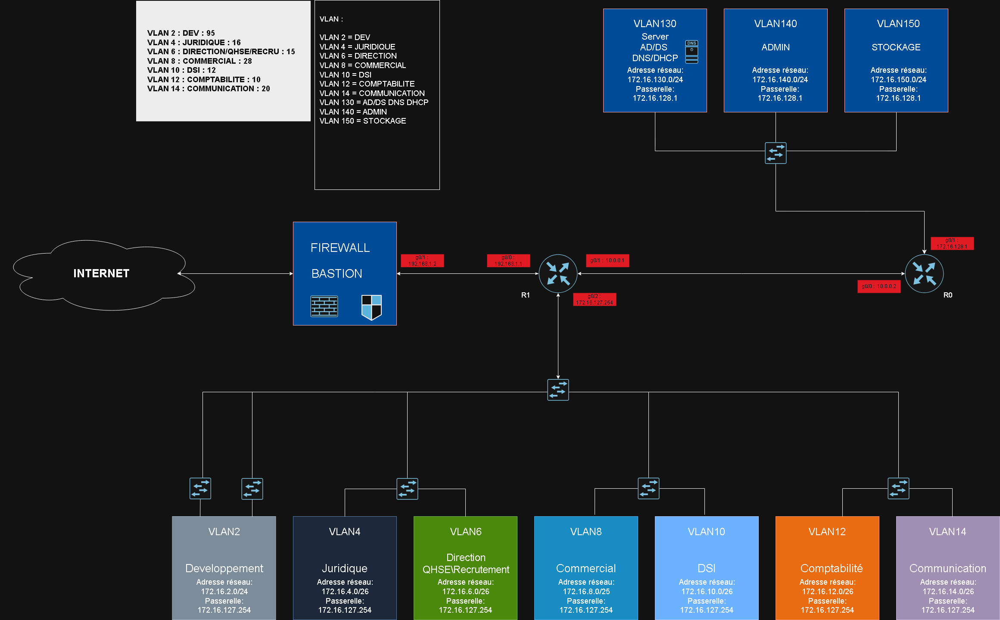

# Sommaire

- [**1. Résumé du projet**](#1-résumé-du-projet)
- [**2. Schéma global de l'infrastructure**](#2-schéma-global-de-linfrastucture)
- [**3. Liste des briques techniques**](#3-liste-des-briques-techniques)
- [**4. Lien vers les autres fichiers HLD**](#4-lien-vers-les-autres-fichiers-hld)

# 1. Résumé du projet

Ce projet est réalisé dans le cadre de la formation TSSR - Technicien Supérieur Systèmes et Réseaux. L'objectif global de ce projet est la conception, la mise en place et la documentation complète d'une nouvelle infrastructure réseau pour la société **BillU**.

Le projet est conditionné comme dans un contexte professionnel réel, avec une organisation par sprints, une gestion des objectifs et une documentation structurée.

# 2. Schéma global de l'infrastucture

# 3. Liste des briques techniques

# 4. Lien vers les autres fichiers HLD

Pour une compréhension détaillée de chaque sous-système, veuillez consulter les documents suivants :

- **[context.md](context.md)** : Contexte métier et besoins principaux et secondaire.
- **[scope.md](scope.md)** : Éléments inclus et exclus du projet et périmètre réseau couvert.
- **[network.md](network.md)** : Architecture réseau détaillée et flux de données.
- **[ip_configuration.md](ip_configuration.md)** : Plan d'adressage IP.
- **[security.md](security.md)** : Principe de sécurité retenus, zones sensibles, politique d'accès, journalisation et sauvegarde.
- **[services.md](services.md)** : Détail du catalogue de services applicatifs.
