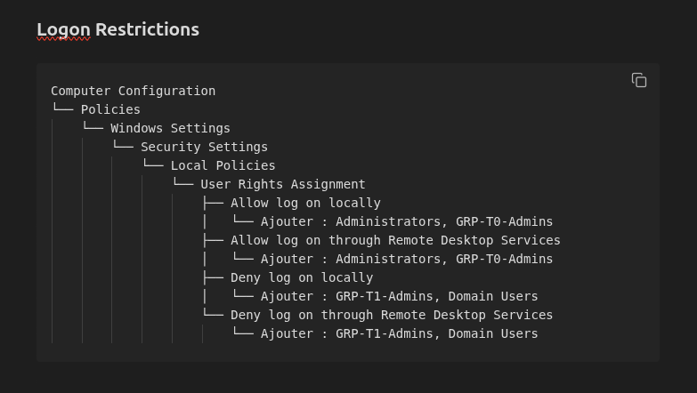
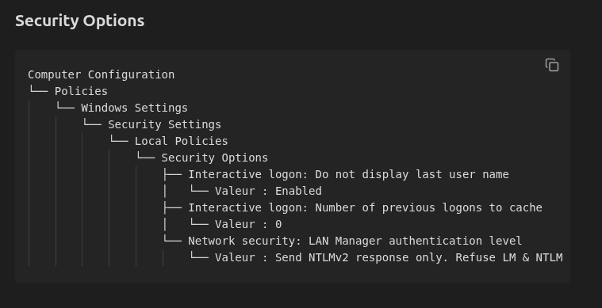
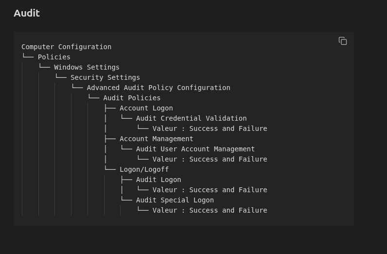
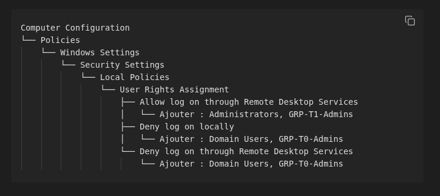
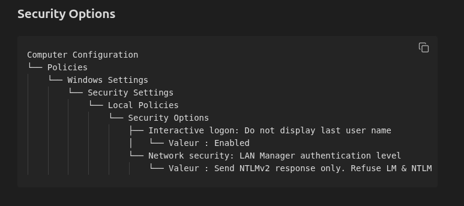
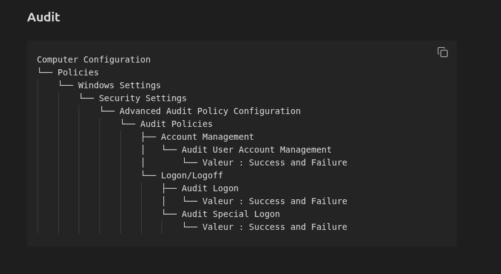
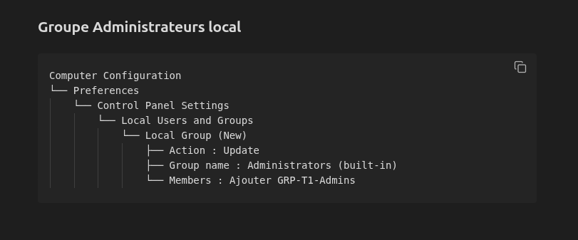
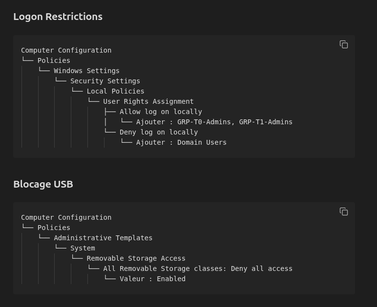

## Configurations des GPO des groupes Admins T0 et T1

**SEC-Admin-T0:**

Appliquée sur l'OU : Domain Controllers

**SEC-Admin-T1:**

Appliquée sur l'OU : Serveur t1

**SEC-PC-Admin**

Appliquée au PC-admin

