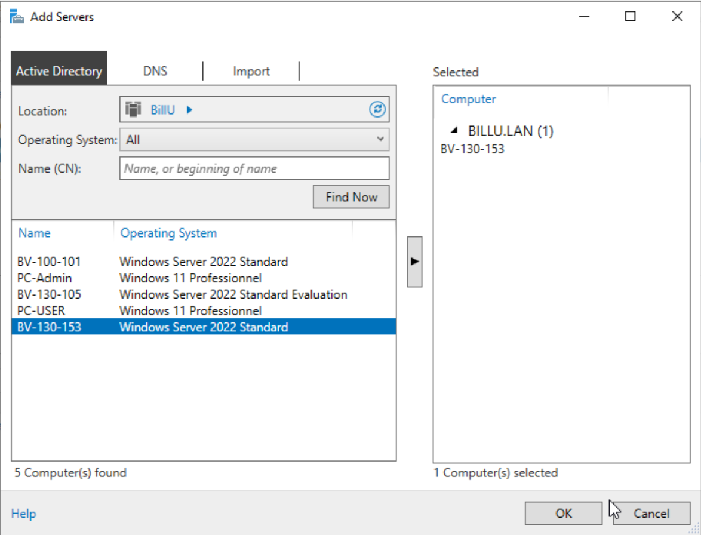
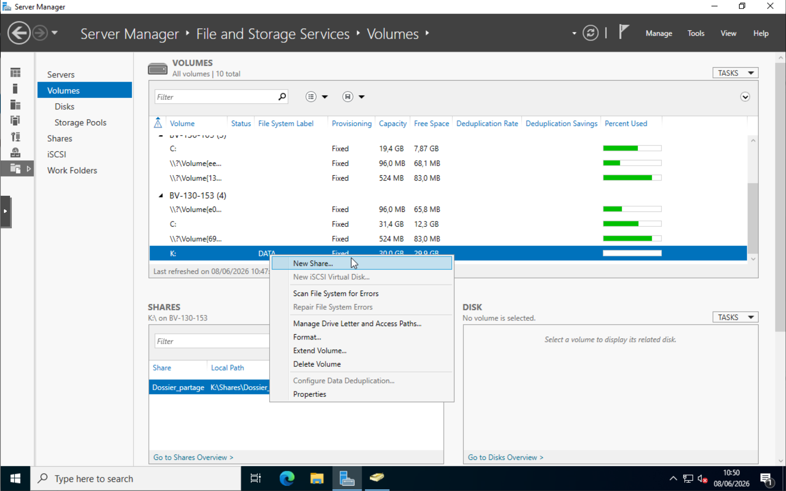
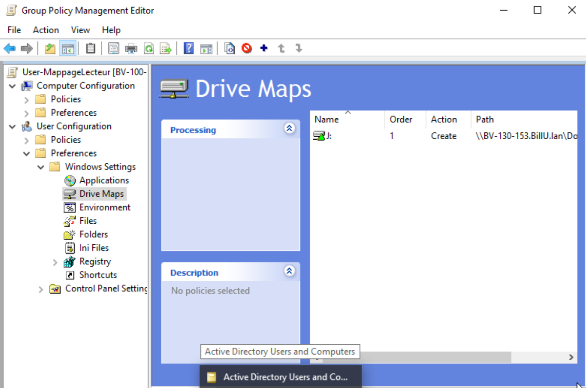
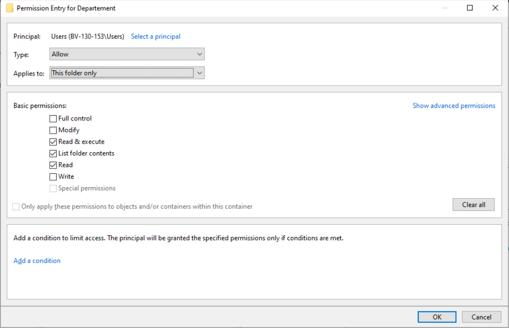
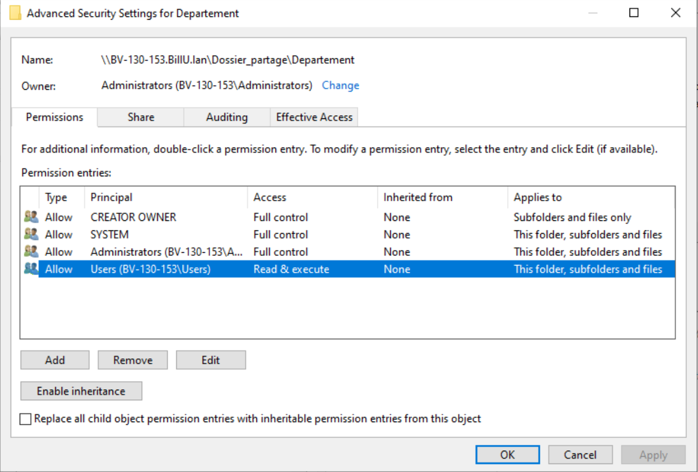
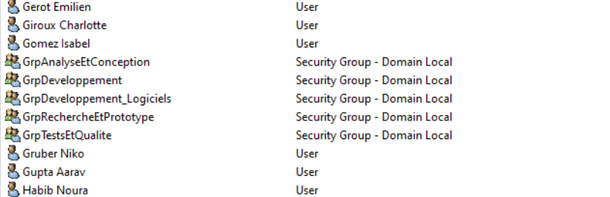
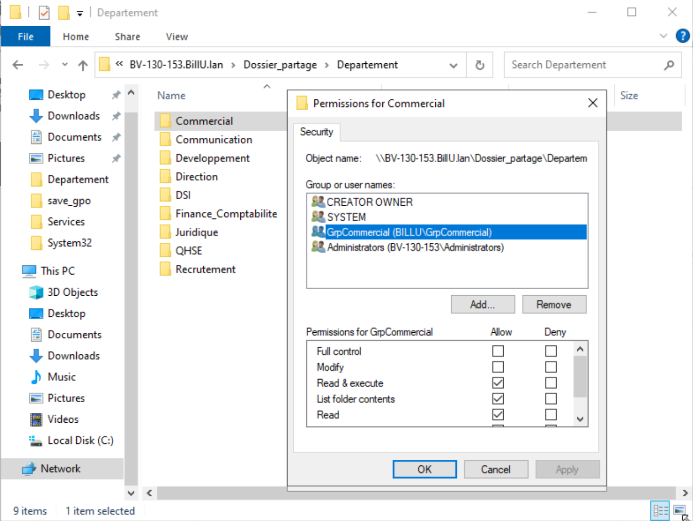
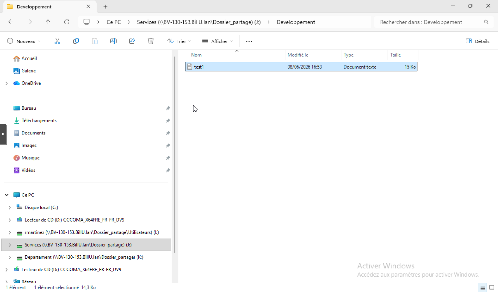

## Partage de dossier réseau ##

#### Serveur de fichier  ####

Afin de pouvoir mettre à la disposition des utilisateurs des ressources sur une lecteur reseau partagé nous avons crée un nouveau serveur de fichier pour heberger les données et on l'a rajouté à 
notre domaine et lié au serveur AD-DS principal.

Puis nous avons crée un dossier de partage sur ce nouveau serveur de fichier qui va nous servir à heberger les données:

#### GPO lecteur ####

Une fois ce fichier principal crée nous avons construit une GPO qui nous a permis de créer 3 lecteur réseau differents et de les rendre disponibles sur tout les PC du domaine:

#### Permissions ####

A partir de là nous avons configuré les differents dossiers (reliés chacun à une lettre de volume différente) afin que les permissions puissent empecher les utilisateurs non autorisés de consulter tout les fichiers sur les lecteurs.

Pour cela nous avons commencé par permettre à tous les utilisateurs de pouvoirs acceder uniquement aux dossiers principaux en les limitant à pouvoir uniquement les traverser:

puis en supprimant l'heritage (clic "enable inheritance") des sous dossiers afin que seuls aient accès les groupes autorisés:

Enfin nous avons créer les groupes autorisés et avons ajouté les utilisateurs voulus:

Et ajouté les groupes dans les permissions de chaque fichiers partagé:

Nous avons testé le résultat sur un PC test dans le domaine et nous avons donc verifié qu'il avait acces aux dossiers partagés pour lesquels il avait les permissions:

