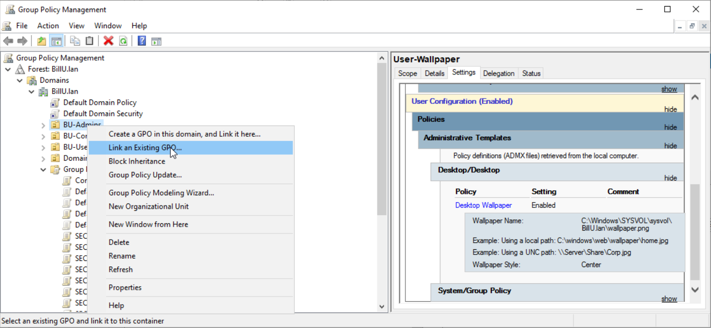
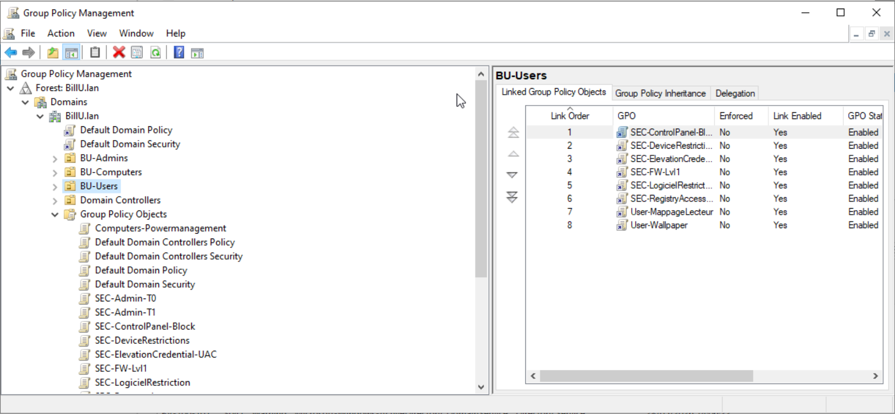
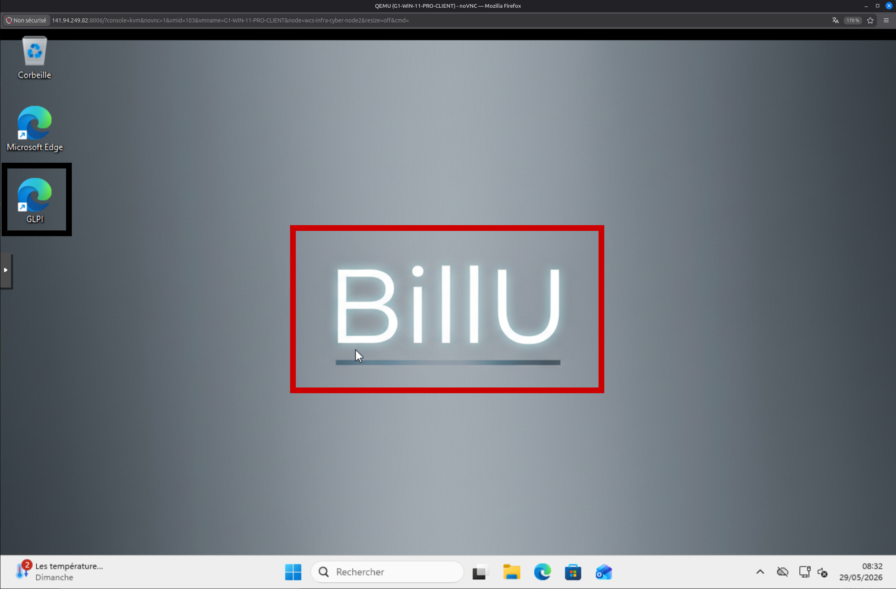
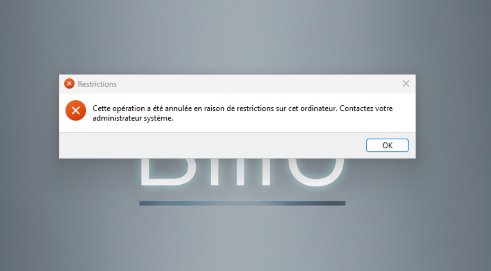

## Configurations des GPO des groupes Admins T0 et T1

**SEC-Admin-T0:**

Appliquée sur l'OU : Domain Controllers

**SEC-Admin-T1:**

Appliquée sur l'OU : Serveur t1

**SEC-PC-Admin**

Appliquée au PC-admin

## Application des differentes GPO aux groupes USERS et COMPUTERS correspondant:

Afin d'appliquer nos gpo nouvellement crée il suffit de les link directement à l'OU sur laquelle on veut les appliquer:

Puis on observe que tout est bien ajouté:

Et enfin on verifie directement sur un PC client de test que tou marche bien:

