## Rôles
Nous avons installer les rôles AD-DS en même temps que le rôle de DNS afin de synchroniser les deux et ne pas avoir de problèmes de noms par la suite.
Les roles ont ete ajouté a partir de manage comme decrit dans la partie DNS

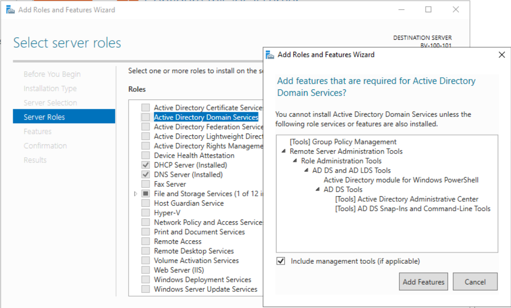
Une fois installée nous avons promus le serveur en controlleur de domaine.
Puis nous avons créé le fôret que nous avons nommé **BillU.lan**:

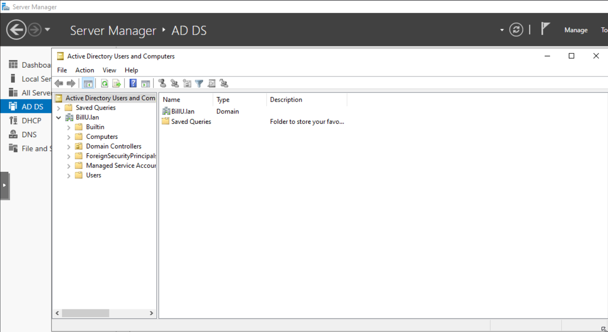

Nous avons lancé l'outil de configuration HelloMyDir afin de parametrer notre forêt selon les bonnes pratiques en vigueur et avons obtenu plusieurs parametres de sécruties supplementaires:

Les PSO:

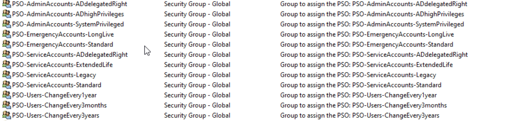

ou encore des parametres par defaut de securité qui s'appliquent à tout le domaine:

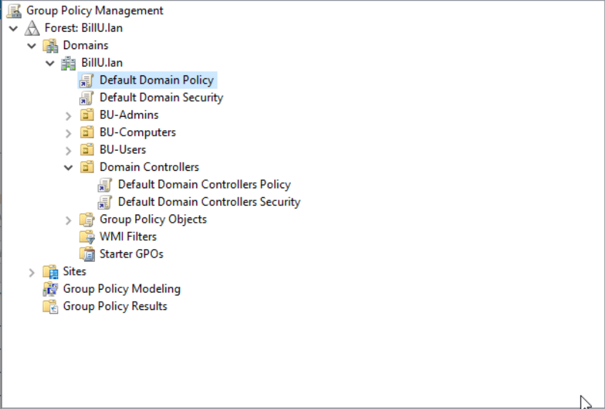

Nous avons ensuite continuer en configurant nos differentes GPO que vous nous aviez demandé:

## Les GPO

### Les GPO sécurité:

-Politique de mot de passe (complexité, longueur, etc.):

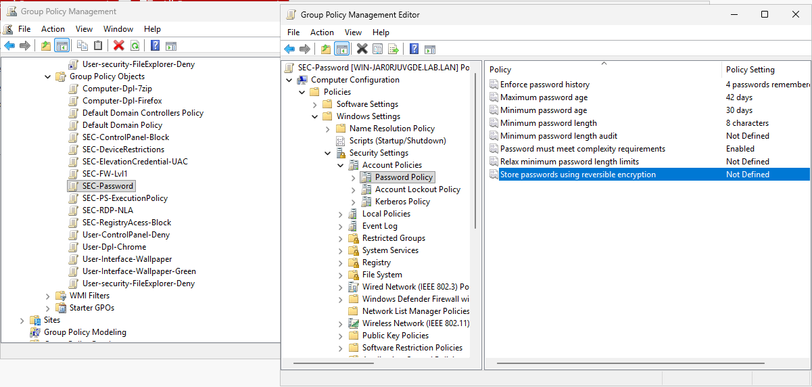

-Restriction d'installation de logiciel pour les utilisateurs:

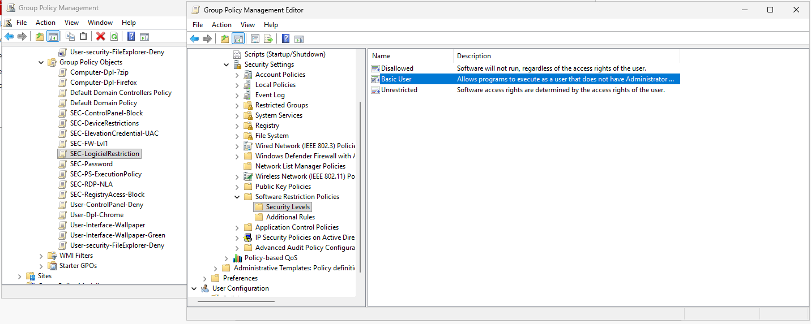

-Blocage de l'accès à la base de registre:

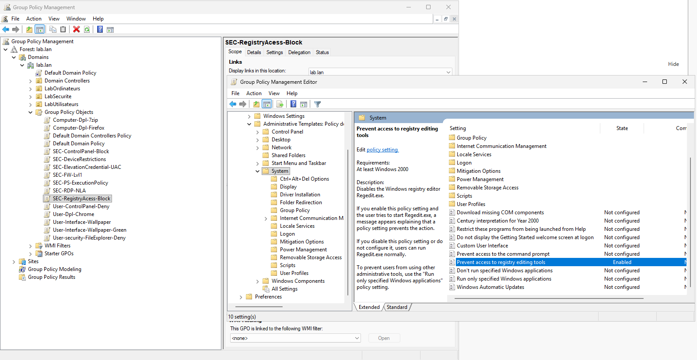

-Blocage complet ou partiel au panneau de configuration:

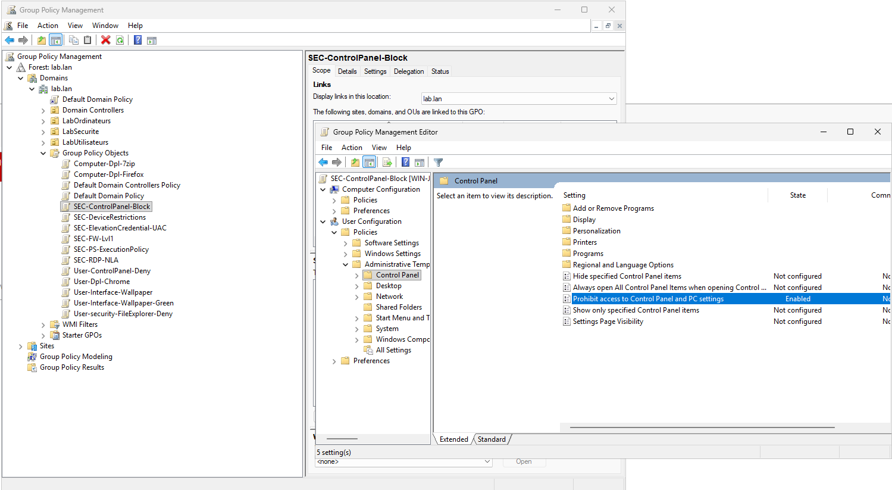

-Restriction des périphériques amovible:

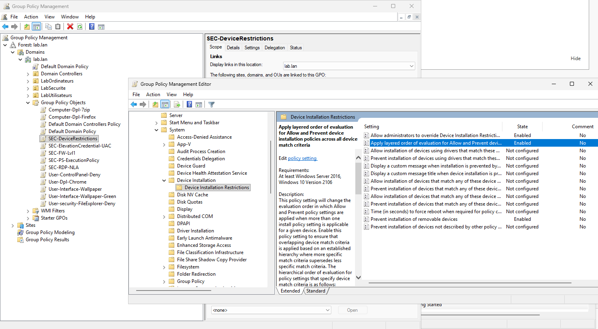

ainsi que:

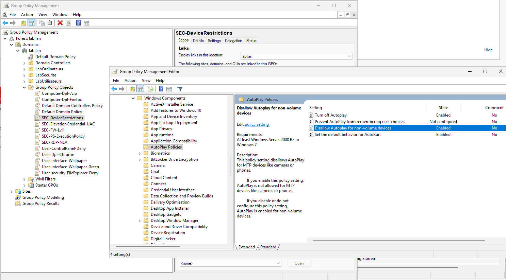

-Gestion du pare-feu:

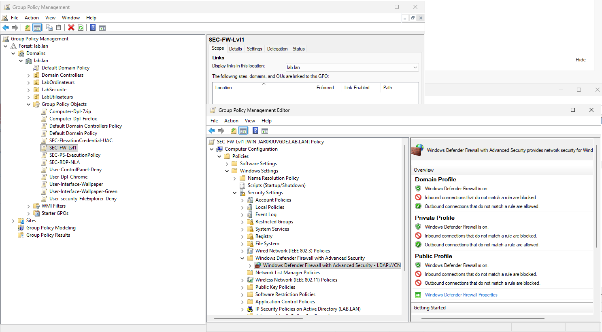

-Forçage du type d'utilisation sécurisée du bureau à distance:
Nous avons renforcer fortement les connexions rdp avec authentification et encryption:

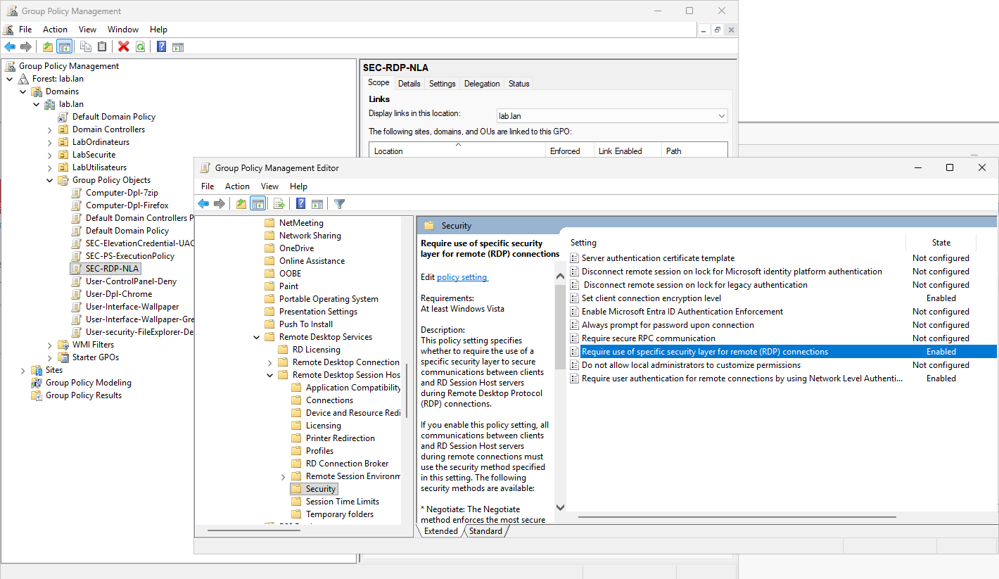

mais aussi avec des logs

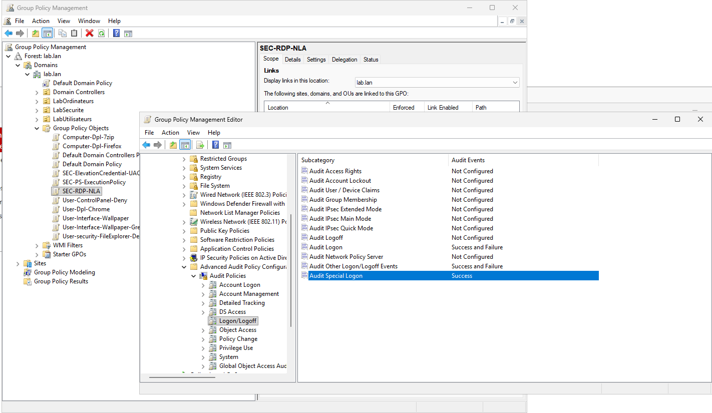

-Limitation des tentatives d'élévation de privilèges:

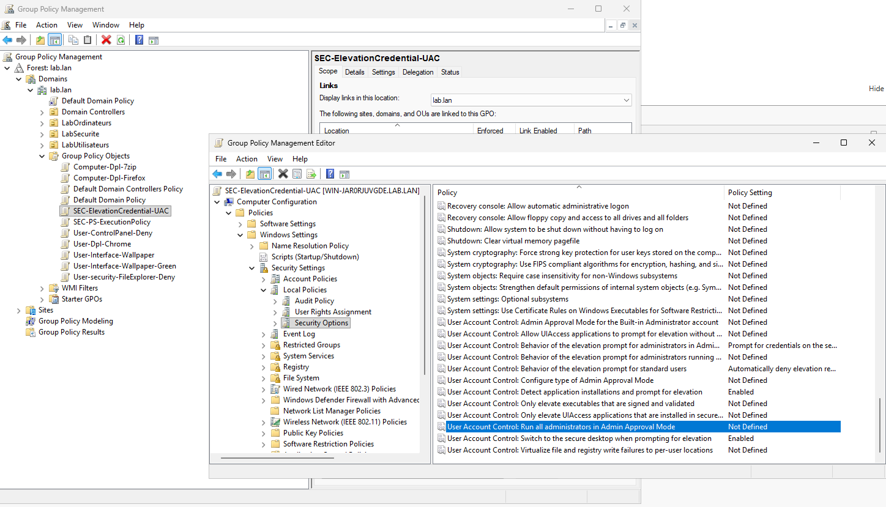

-Politique de sécurité PowerShell:

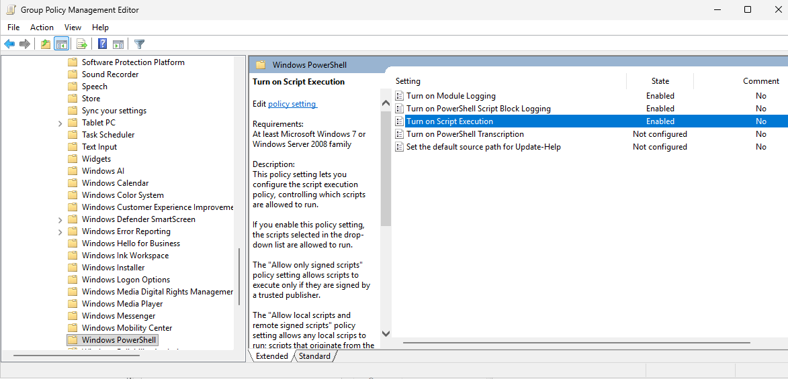

### Les GPO Standards

-Mappage de lecteurs:

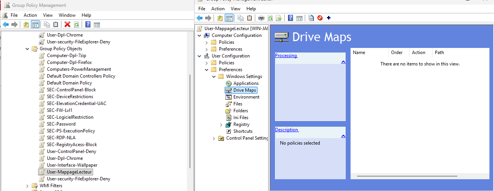

-Gestion de l'alimentation:

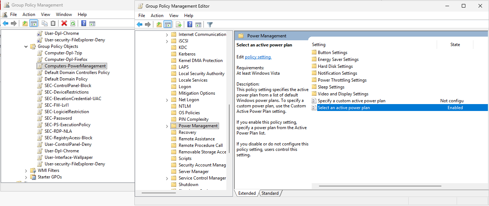

-Fond d'écran:

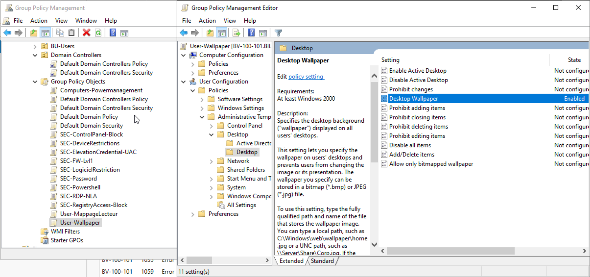

