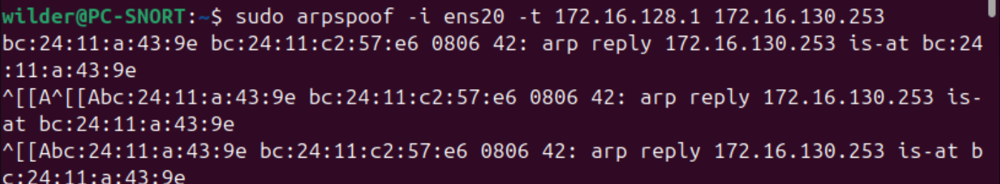
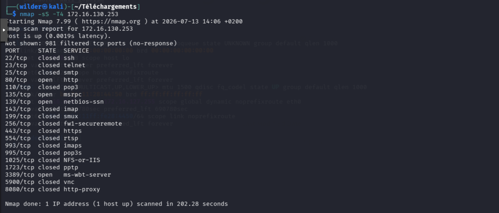
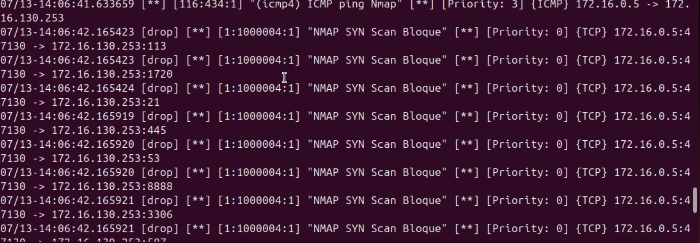

# Test de blocage d'un scan Nmap via Snort 3 (mode inline + ARP Spoofing)

## Contexte

| Élément | Valeur |
| :-- | :-- |
| Machine Snort | `PC-SNORT`, interface `ens20`, mode inline (`--daq nfq`, `-Q`) |
| Machine attaquante | Kali Linux — `172.16.0.5` |
| Machine cible | `172.16.130.253` |
| Passerelle spoofée | `172.16.128.1` |

---

## 1. Paramétrage — ARP Spoofing actif

```bash
sudo arpspoof -i ens20 -t 172.16.128.1 172.16.130.253
```




Le PC Snort envoie en continu des réponses ARP forgées à la passerelle (`172.16.128.1`), lui faisant croire que l'adresse MAC de la cible (`172.16.130.253`) est celle du PC Snort (`bc:24:11:a43:9e`).

Combiné à l'`ip_forward` actif, tout le trafic à destination/en provenance de la cible transite désormais par le PC Snort, qui peut l'inspecter et le bloquer via `iptables NFQUEUE`.

---

## 2. Test — Scan Nmap SYN depuis l'attaquant

```bash
nmap -sS -T4 172.16.130.253
```



**Résultat observé côté Nmap :**

- Scan terminé en **202 secondes** (anormalement long pour un `-T4`, censé être rapide)
- **981 ports** en état `filtered (no-response)`
- Seuls **4 ports** remontent un état franc (`open` / `closed`) : `80`, `135`, `139`, `3389`

> Un scan SYN normal sur ce nombre de ports prendrait quelques secondes. La lenteur et le grand nombre de ports "filtered" (silence radio, sans RST ni SYN-ACK) sont la signature d'un **blocage actif en cours de scan**, pas d'un pare-feu qui répondrait explicitement.

---

## 3. Résultat — Alertes Snort

```text
[drop] [1:1000004:1] "NMAP SYN Scan Bloque" [**] {TCP} 172.16.0.5:47130 -> 172.16.130.253:113
[drop] [1:1000004:1] "NMAP SYN Scan Bloque" [**] {TCP} 172.16.0.5:47130 -> 172.16.130.253:1720
[drop] [1:1000004:1] "NMAP SYN Scan Bloque" [**] {TCP} 172.16.0.5:47130 -> 172.16.130.253:21
...
```



- **GID:SID `1:1000004`** → règle personnalisée du fichier `local.rules` (SYN scan avec `detection_filter`)
- Le tag **`[drop]`** en début de ligne confirme que Snort a réellement **rejeté** ces paquets (mode inline actif), pas seulement alerté
- Une alerte native `(icmp4) ICMP ping Nmap` `[116:434:1]` apparaît juste avant : Nmap envoie un ping ICMP de découverte d'hôte en préambule du scan, détecté nativement par Snort

---

## 4. Analyse du comportement

| Observation | Explication |
| :-- | :-- |
| Ports 80, 135, 139, 3389 vus normalement | Premiers paquets SYN envoyés avant que le seuil (`count 20, seconds 5`) du `detection_filter` soit atteint |
| 981 ports `filtered` | Une fois le seuil dépassé, Snort passe en `drop` sur les SYN suivants de cette source → aucune réponse ne remonte à Nmap, qui les classe `filtered` |
| Scan très lent (202s au lieu de quelques secondes) | Nmap retente les ports sans réponse (retransmissions), ce qui allonge fortement le scan — effet secondaire typique d'un DROP silencieux comparé à un REJECT explicite |

---

## 5. Conclusion

Le dispositif fonctionne comme prévu, dans l'ordre suivant :

1. **ARP Spoofing** → détourne le trafic de la cible vers le PC Snort
2. **Snort inline (NFQ)** → inspecte chaque paquet en temps réel
3. **Règle `drop` avec `detection_filter`** → laisse passer les premiers paquets (comportement "normal"), puis bloque activement dès que le rythme dépasse le seuil défini (20 SYN / 5s)
4. **Résultat mesurable côté attaquant** → scan ralenti, incomplet, la majorité des ports remontant `filtered` au lieu de leur état réel

> **Note :** le seuil du `detection_filter` explique pourquoi le blocage n'est pas total dès le premier paquet. Voir les règles sans seuil (NULL / FIN / XMAS / ACK) pour un blocage immédiat dès le premier paquet correspondant.
