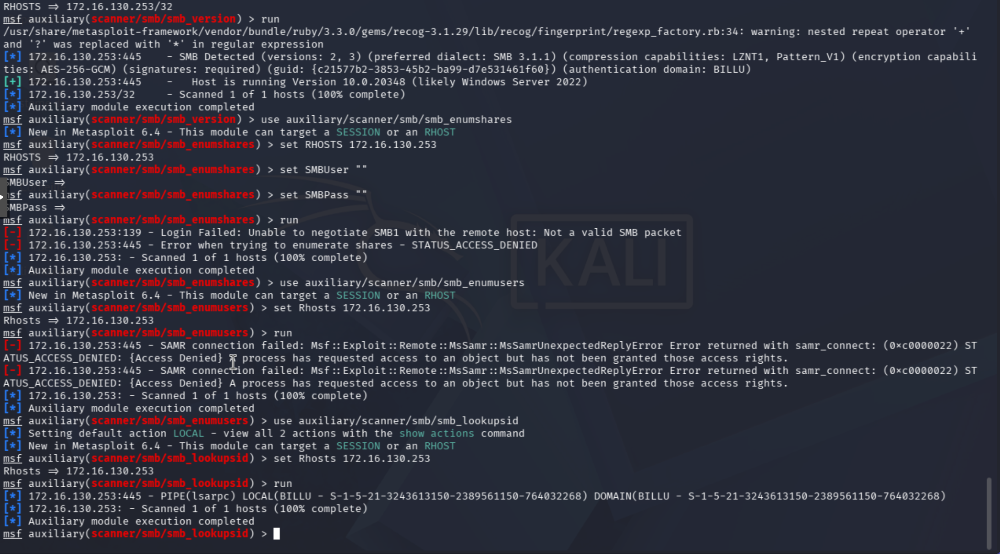
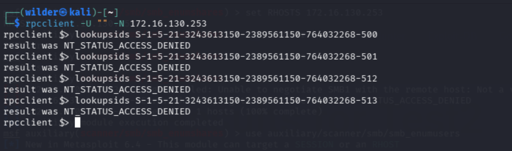
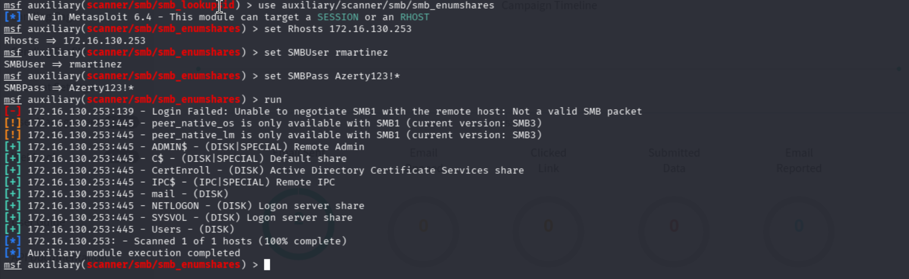
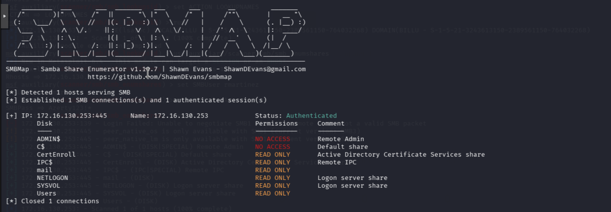

# Audit de sécurité SMB — Contrôleur de domaine BILLU

## Contexte

| Élément | Valeur |
| :-- | :-- |
| Cible | `172.16.130.253` — Contrôleur de domaine (DC) |
| OS détecté | Windows Server 2022 (build `10.0.20348`) |
| Domaine | `BILLU` |
| SID domaine | `S-1-5-21-3243613150-2389561150-764032268` |
| Outils utilisés | Metasploit (`msfconsole`), `rpcclient`, `smbmap` |
| Compte authentifié utilisé | `rmartinez` (utilisateur standard, non privilégié) |

L'objectif de cet audit est d'évaluer la surface d'exposition du DC via le protocole SMB, en testant successivement l'accès **anonyme** puis l'accès **authentifié avec un compte à faibles privilèges** — deux scénarios réalistes (poste non protégé / compte utilisateur compromis).

---

## 1. Reconnaissance initiale — `smb_version`

```
use auxiliary/scanner/smb/smb_version
set RHOSTS 172.16.130.253
run
```

**Résultat :**



```text
[*] 172.16.130.253:445 - SMB Detected (versions: 2, 3) (preferred dialect: SMB 3.1.1)
    (encryption capabilities: AES-256-GCM) (signatures: required)
[+] 172.16.130.253:445 - Host is running Version 10.0.20348 (likely Windows Server 2022)
```

**Analyse :**
- **SMBv1 absent** de la liste des versions supportées → élimine d'office toute exploitation de type **EternalBlue** (MS17-010), qui nécessite SMBv1
- **Signing SMB obligatoire** (`signatures: required`) → protège contre les attaques de type **SMB Relay**
- **Chiffrement AES-256-GCM** actif → configuration SMB moderne et durcie

➡️ Premier constat : le service SMB est correctement mis à jour et configuré, la voie d'exploitation directe est fermée.

---

## 2. Audit en accès anonyme (non authentifié)

### 2.1 Liste des partages — `smb_enumshares`

```
set SMBUser ""
set SMBPass ""
run
```

**Résultat :**

```text
[-] 172.16.130.253:139 - Unable to negotiate SMB1: Not a valid SMB packet
[-] 172.16.130.253:445 - Error when trying to enumerate shares - STATUS_ACCESS_DENIED
```

➡️ **Bloqué.** Aucune liste de partage accessible sans authentification.

### 2.2 Énumération des utilisateurs — `smb_enumusers`

**Résultat :**
```text
[-] 172.16.130.253:445 - SAMR connection failed: STATUS_ACCESS_DENIED
    {Access Denied} A process has requested access to an object
    but has not been granted those access rights.
```

➡️ **Bloqué.** Le canal **SAMR** (énumération de comptes) refuse toute requête anonyme.

### 2.3 Récupération SID de domaine — `smb_lookupsid`

**Résultat :**
```text
[*] 172.16.130.253:445 - PIPE(lsarpc) LOCAL(BILLU - S-1-5-21-3243613150-2389561150-764032268)
    DOMAIN(BILLU - S-1-5-21-3243613150-2389561150-764032268)
```

➡️ **Fonctionne.** Contrairement à SAMR, le pipe **`lsarpc`** (LSA) répond en anonyme et révèle le **nom de domaine** et son **SID** — une fuite d'information mineure mais réelle.

### 2.4 Tentative de RID cycling — `rpcclient`




**Résultat :** la connexion RPC s'établit, mais chaque tentative de résolution renvoie :
```text
result was NT_STATUS_ACCESS_DENIED
```

➡️ **Bloqué.** Le canal `lsarpc` autorise la connexion et la remontée du SID racine, mais **refuse** la résolution des RID en noms de comptes — le RID cycling est donc inefficace ici.

### Bilan de la phase anonyme

| Test | Résultat | Sécurisé ? |
| :-- | :-- | :-: |
| Liste des partages | ❌ Bloqué (`ACCESS_DENIED`) | ✅ |
| Énumération utilisateurs (SAMR) | ❌ Bloqué (`ACCESS_DENIED`) | ✅ |
| SID de domaine (LSA) | ✅ Accessible | ⚠️ Fuite mineure |
| RID cycling / résolution de noms | ❌ Bloqué (`ACCESS_DENIED`) | ✅ |

---

## 3. Audit en accès authentifié (compte standard `rmartinez`)

Même jeu de tests, mais avec des identifiants valides d'un compte utilisateur du domaine sans privilège particulier.

### 3.1 Liste des partages — `smb_enumshares` authentifié

```
set SMBUser rmartinez
set SMBPass Azerty123!*
run
```

**Résultat :**



➡️ **Changement radical par rapport à l'anonyme** : dès qu'un compte standard est authentifié, la liste complète des partages devient visible, y compris les partages "métier" (`mail`, `Users`) et le partage lié à la PKI d'entreprise (`CertEnroll`).

### 3.2 Cartographie des permissions réelles — `smbmap`

```bash
smbmap -H 172.16.130.253 -u rmartinez -p 'Azerty123!*'
```

**Résultat :**



| Partage | Permissions | Commentaire |
| :-- | :-- | :-- |
| `ADMIN$` | ❌ NO ACCESS | ✅ Bien restreint |
| `C$` | ❌ NO ACCESS | ✅ Bien restreint |
| `CertEnroll` | 🟡 READ ONLY | AD CS — cohérent |
| `IPC$` | 🟡 READ ONLY | Standard |
| `mail` | 🟡 READ ONLY | Partage métier — à explorer |
| `NETLOGON` | 🟡 READ ONLY | ✅ Attendu |
| `SYSVOL` | 🟡 READ ONLY | ✅ Attendu |
| `Users` | 🟡 READ ONLY | Partage métier — à explorer |

➡️ **Point positif majeur** : aucun accès `WRITE` détecté sur aucun partage, y compris les partages métier. Les partages système (`ADMIN$`, `C$`) restent totalement fermés même à un compte authentifié.

---

## 4. Conclusion générale de l'audit

### Ce qui est bien sécurisé

- ✅ SMBv1 désactivé → immunité à EternalBlue / WannaCry
- ✅ Signing SMB obligatoire → protection anti-relay
- ✅ Chiffrement AES-256-GCM actif
- ✅ Énumération anonyme des partages **bloquée**
- ✅ Énumération anonyme des utilisateurs (SAMR) **bloquée**
- ✅ RID cycling anonyme **bloqué** (même avec le SID en main)
- ✅ Aucun droit `WRITE` détecté sur aucun partage, même authentifié
- ✅ Partages sensibles (`ADMIN$`, `C$`) fermés même pour un compte standard

### Points d'attention identifiés

| Sévérité | Constat |
| :-- | :-- |
| 🟢 Mineure | Le SID de domaine et son nom fuitent en anonyme via le pipe `lsarpc` — insuffisant seul pour une attaque, mais facilite la reconnaissance |
| 🟡 À vérifier | Tout compte de domaine, même non privilégié, peut lister **l'intégralité** des partages et leurs permissions — expose la cartographie complète du stockage réseau à quiconque obtient des identifiants valides (ex : phishing) |
| 🟡 À vérifier | Contenu des partages `mail`, `Users` et des scripts dans `SYSVOL` non encore audité en détail |

### Explorations complémentaires recommandées

1. **Contenu des partages accessibles en lecture**
   - `smbclient //172.16.130.253/mail -U 'rmartinez%Azerty123!*'`
   - `smbclient //172.16.130.253/Users -U 'rmartinez%Azerty123!*'`
   - Vérifier si `rmartinez` peut voir les répertoires d'autres utilisateurs (cloisonnement).

2. **Scripts de logon dans SYSVOL**
   - Rechercher dans `\<domaine>\scripts\` et `\<domaine>\Policies\` d'éventuels `.bat` / `.ps1` / `.vbs` contenant des identifiants en clair — découverte très fréquente en environnement AD.

3. **Durcissement du pipe `lsarpc`**
   - Vérifier/renforcer la clé de registre `RestrictAnonymous` (niveau 2 recommandé si compatible avec les besoins applicatifs) pour supprimer la fuite résiduelle du SID de domaine.

4. **Axes hors SMB à envisager**
   - **Kerberoasting** / **AS-REP Roasting** sur les comptes de service
   - Audit des templates de certificats **AD CS** (le partage `CertEnroll` confirme la présence d'une PKI — mauvaise configuration de template = vecteur d'élévation de privilèges connu, ex. ESC1-ESC8)
   - Vérification des ACL Active Directory (délégations, droits GenericAll/WriteDACL mal attribués)

---

## Synthèse

| Phase | Vecteurs testés | Résultat global |
| :-- | :-- | :-: |
| Anonyme | Partages, utilisateurs, RID cycling | 🟢 Bien protégé |
| Authentifié (compte standard) | Partages, permissions | 🟡 Visibilité large mais accès en lecture seule, pas d'écriture détectée |

Le DC présente une posture de sécurité SMB globalement **solide** pour un attaquant non authentifié. Le principal risque résiduel se situe **après compromission d'un compte utilisateur standard** (ex. phishing), où la visibilité sur l'ensemble des partages devient totale — d'où l'intérêt de poursuivre l'audit sur le contenu réel de ces partages et sur les vecteurs Kerberos/AD CS pour une évaluation complète du DC.
