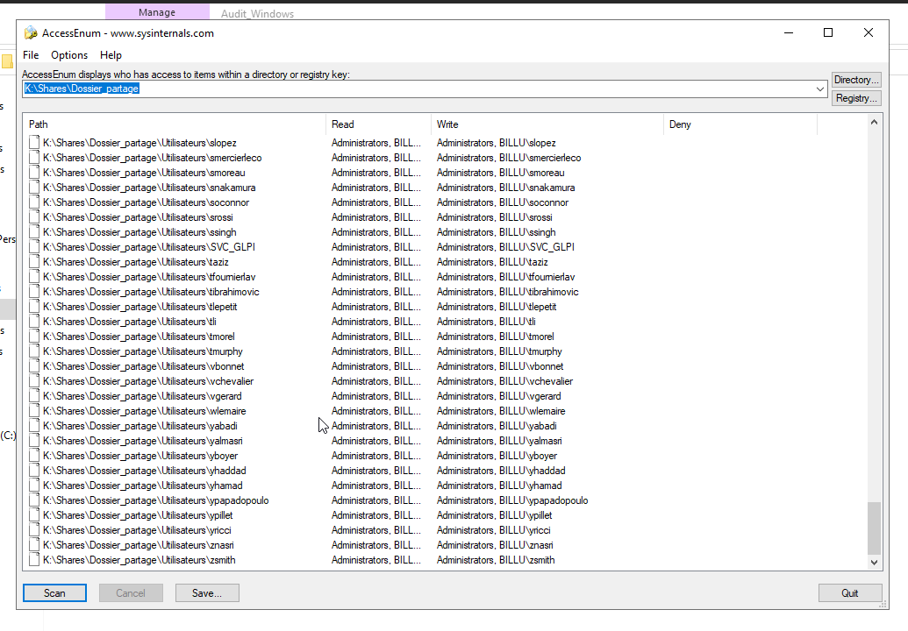
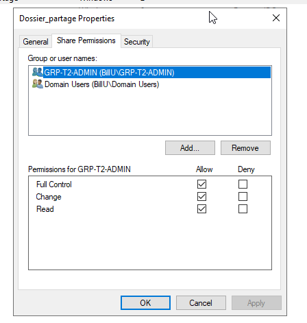
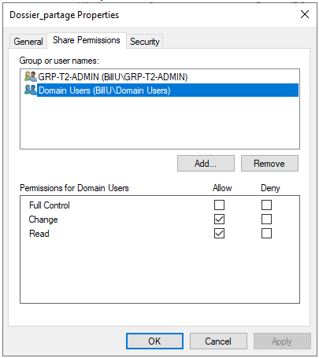
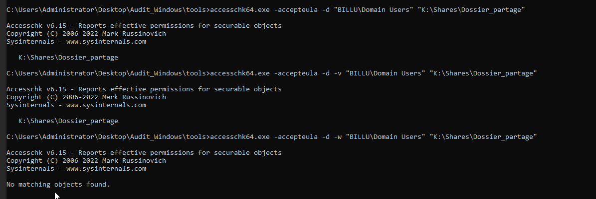
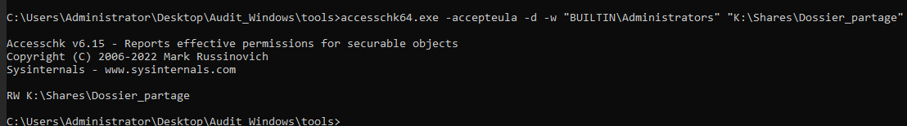
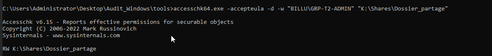

- [**1. Audit des permissions NTFS avec AccessEnum**](#1-audit-des-permissions-ntfs-avec-accessEnum)
- [**2. Audit des permissions avec AccessChk**](#2-audit-des-permissions-avec-accessChk)
- [**3. 3. Test de ShareEnum**](#3-test-de-shareEnum)


## 1. Audit des permissions NTFS avec AccessEnum

### Objectif

L'objectif de cet audit est de vérifier les permissions NTFS appliquées sur le dossier de partage principal du serveur de stockage.

Cet audit permet de contrôler que les utilisateurs et les groupes Active Directory disposent uniquement des accès nécessaires à leurs dossiers respectifs.

L'objectif est également d'identifier d'éventuelles permissions trop larges, comme :

- `Everyone`
- `Domain Users`
- `Authenticated Users`
- droits en écriture non justifiés
- droits de modification ou de contrôle total trop permissifs

---

### Périmètre de l'audit

L'audit a été réalisé sur le serveur de stockage Windows.

Dossier audité :

```text
K:\Shares\Dossier_partage
```

Ce dossier contient les espaces partagés de l'entreprise, notamment :

- les dossiers personnels des utilisateurs ;
- les dossiers communs ;
- les dossiers de départements ;
- les dossiers liés aux services de l'entreprise.

---

### Outil utilisé

L'outil utilisé pour cet audit est `AccessEnum`, fourni par Microsoft Sysinternals.

AccessEnum permet d'analyser rapidement les permissions NTFS appliquées sur une arborescence de dossiers.

Il affiche notamment :

- les chemins analysés ;
- les groupes ou utilisateurs ayant des droits en lecture ;
- les groupes ou utilisateurs ayant des droits en écriture ;
- les éventuelles permissions particulières.

---

### Lancement de l'audit

L'outil `AccessEnum` a été lancé directement depuis le serveur de stockage afin d'analyser les permissions NTFS locales.

Chemin sélectionné dans AccessEnum :

```text
K:\Shares\Dossier_partage
```

L'audit a ensuite été lancé avec le bouton `Scan`.

Cette méthode permet d'analyser le dossier parent ainsi que l'ensemble des sous-dossiers présents dans l'arborescence.

---

### Résultat du scan AccessEnum

Le scan AccessEnum a permis de visualiser les permissions NTFS appliquées aux différents dossiers.

Les dossiers personnels des utilisateurs sont configurés de manière à limiter l'accès à :

- l'utilisateur propriétaire du dossier ;
- les administrateurs ;
- les groupes d'administration nécessaires.

Exemple observé :

```text
K:\Shares\Dossier_partage\Utilisateurs\nom_utilisateur
```

Le dossier personnel est accessible en écriture uniquement par l'utilisateur concerné et les administrateurs.


---

### Analyse des dossiers de départements

Les dossiers de départements sont cloisonnés par groupes Active Directory.

Chaque service dispose de son propre groupe, qui est autorisé uniquement sur le dossier correspondant.

Exemples observés :

| Dossier | Groupe autorisé |
|---|---|
| `Departement\Commercial` | `GrpCommercial` |
| `Departement\Communication` | `GrpCommunication` |
| `Departement\Developpement_Logiciels` | `GrpDeveloppement` |
| `Departement\Direction` | `GrpDirection` |
| `Commun\Departements\DSI` | `BU_DL_Commun_DSI_M` |
| `Commun\Departements\Direction` | `BU_DL_Commun_Direction_M` |
| `Commun\Transverse` | `BU_DL_Commun_Transverse_M` |

Cette organisation permet de respecter le principe du moindre privilège.

Chaque groupe dispose uniquement des droits nécessaires sur son propre espace de travail.

---

### Vérification des droits sur le dossier racine

Le dossier racine du partage a également été vérifié depuis l'onglet `Security`.

Chemin vérifié :

```text
K:\Shares\Dossier_partage
```

Les droits observés sont les suivants :

| Groupe / utilisateur | Droits |
|---|---|
| `SYSTEM` | Droits système |
| `Administrators` | Contrôle total |
| `Users` | Lecture, exécution et affichage du contenu |

Les utilisateurs disposent uniquement des droits nécessaires pour parcourir l'arborescence.

Les droits d'écriture sont ensuite appliqués uniquement sur les sous-dossiers autorisés par groupe ou par utilisateur.

---

### Vérification complémentaire des permissions de partage SMB

En complément de l'audit NTFS réalisé avec AccessEnum, les permissions du partage SMB ont été vérifiées depuis les propriétés du dossier partagé.

Chemin :

```text
Dossier_partage
→ Properties
→ Share Permissions
```

Lors de la vérification, le groupe `Everyone` était présent dans les permissions du partage.

Afin d'améliorer la sécurité, ce groupe a été retiré.

La configuration finale du partage est la suivante :

| Groupe | Full Control | Change | Read | Rôle |
|---|---:|---:|---:|---|
| `GRP-T2-ADMIN` | Oui | Oui | Oui | Administration complète du partage |
| `Domain Users` | Non | Oui | Oui | Accès réseau au partage pour les utilisateurs du domaine |
| `Everyone` | Non | Non | Non | Groupe supprimé du partage |



---

### Explication de la configuration

La sécurité d'accès au partage repose sur deux niveaux de permissions :

| Niveau | Rôle |
|---|---|
| Permissions de partage SMB | Autorisent l'accès au partage depuis le réseau |
| Permissions NTFS | Définissent précisément les droits sur les dossiers et fichiers |

Dans cette configuration :

- `Domain Users` peut accéder au partage depuis le réseau ;
- `GRP-T2-ADMIN` peut administrer le partage ;
- les permissions NTFS limitent ensuite l'accès aux dossiers autorisés ;
- chaque groupe métier accède uniquement à son propre dossier ;
- le groupe `Everyone` n'est plus utilisé sur le partage.

---

### Points de contrôle réalisés

Les vérifications suivantes ont été réalisées :

| Point contrôlé | Résultat |
|---|---|
| Scan du dossier parent avec AccessEnum | OK |
| Scan des sous-dossiers | OK |
| Vérification des dossiers utilisateurs | OK |
| Vérification des dossiers de départements | OK |
| Présence de groupes métiers dédiés | OK |
| Cloisonnement des accès par service | OK |
| Vérification des permissions SMB | OK |
| Suppression du groupe `Everyone` du partage | OK |
| Conservation de l'accès réseau pour `Domain Users` | OK |
| Administration réservée au groupe `GRP-T2-ADMIN` | OK |

---

### Risques recherchés pendant l'audit

L'audit avait pour objectif d'identifier les mauvaises pratiques suivantes :

| Risque recherché | Exemple |
|---|---|
| Accès trop large | `Everyone` avec droits d'écriture |
| Droits excessifs | `Domain Users` avec contrôle total |
| Mauvais cloisonnement | Tous les services accèdent au même dossier |
| Dossier sensible trop ouvert | Comptabilité accessible à tous |
| Permissions non maîtrisées | Droits hérités non contrôlés |

Aucune anomalie critique de ce type n'a été constatée sur les dossiers de départements affichés.

---

### Conclusion

L'audit réalisé avec AccessEnum a permis de vérifier les permissions NTFS du dossier de partage principal du serveur de stockage.

Les résultats montrent que les dossiers sont correctement organisés par service et par utilisateur.

Les dossiers de départements sont cloisonnés grâce à des groupes Active Directory dédiés. Chaque groupe dispose uniquement des droits nécessaires sur son propre dossier.

Une vérification complémentaire des permissions SMB a également été réalisée. Le groupe `Everyone` a été retiré du partage afin de renforcer la sécurité.

La configuration finale permet donc :

- un accès réseau contrôlé au partage ;
- une administration réservée aux administrateurs ;
- un cloisonnement des droits par service ;
- une limitation des accès selon les groupes Active Directory ;
- une réduction des permissions trop larges.

L'audit est considéré comme conforme aux bonnes pratiques de sécurité Windows Server.


## 2. Audit des permissions avec AccessChk

### Objectif

L'objectif de cet audit est de vérifier précisément les permissions appliquées sur le dossier de partage principal du serveur de stockage Windows.

L'outil utilisé est `AccessChk`, issu de la suite Microsoft Sysinternals.  
Il permet de contrôler les droits effectifs d'un utilisateur ou d'un groupe sur un fichier, un dossier, un service ou une clé de registre.

Dans notre cas, AccessChk est utilisé pour vérifier les droits d'accès sur le dossier suivant :

```text
K:\Shares\Dossier_partage
```

L'audit permet de confirmer que :

- les utilisateurs du domaine ne disposent pas de droits d'écriture directs sur la racine du partage ;
- les administrateurs disposent bien des droits nécessaires ;
- le groupe d'administration `GRP-T2-ADMIN` possède les droits attendus ;
- les permissions respectent le principe du moindre privilège.

---

### Machine utilisée

L'audit a été réalisé directement depuis le serveur de stockage Windows.

| Élément | Valeur |
|---|---|
| Serveur audité | `BV-130-153` |
| Dossier audité | `K:\Shares\Dossier_partage` |
| Outil utilisé | `accesschk64.exe` |
| Type d'audit | Vérification des droits d'écriture |

L'outil a été lancé depuis le dossier suivant :

```text
C:\Users\Administrator\Desktop\Audit_Windows\tools
```

---

### Commandes utilisées

Les commandes ont été exécutées depuis une invite de commandes lancée en administrateur.

#### Vérification des droits de `Domain Users`

```cmd
accesschk64.exe -accepteula -d -w "BILLU\Domain Users" "K:\Shares\Dossier_partage"
```

Résultat obtenu :

```text
No matching objects found.
```

Ce résultat indique que le groupe `Domain Users` ne possède pas de droit d'écriture direct sur la racine du partage.

#### Vérification des droits de `BUILTIN\Administrators`

```cmd
accesschk64.exe -accepteula -d -w "BUILTIN\Administrators" "K:\Shares\Dossier_partage"
```

Résultat obtenu :

```text
RW K:\Shares\Dossier_partage
```

Le résultat `RW` signifie :

| Lettre | Signification |
|---|---|
| `R` | Read |
| `W` | Write |

Le groupe `BUILTIN\Administrators` dispose donc bien de droits en lecture et en écriture sur le dossier audité.

#### Vérification des droits de `GRP-T2-ADMIN`

```cmd
accesschk64.exe -accepteula -d -w "BILLU\GRP-T2-ADMIN" "K:\Shares\Dossier_partage"
```

Résultat obtenu :

```text
RW K:\Shares\Dossier_partage
```

Le groupe `GRP-T2-ADMIN` dispose également de droits en lecture et en écriture sur le dossier racine du partage.

---

### Résultats de l'audit

| Groupe testé | Chemin audité | Résultat AccessChk | Interprétation |
|---|---|---|---|
| `BILLU\Domain Users` | `K:\Shares\Dossier_partage` | `No matching objects found` | Aucun droit d'écriture direct détecté |
| `BUILTIN\Administrators` | `K:\Shares\Dossier_partage` | `RW` | Droits de lecture et d'écriture présents |
| `BILLU\GRP-T2-ADMIN` | `K:\Shares\Dossier_partage` | `RW` | Droits de lecture et d'écriture présents |

---

### Analyse

Le test réalisé sur le groupe `Domain Users` montre qu'aucun droit d'écriture direct n'est appliqué sur la racine du partage.

Cela est important, car la racine d'un partage ne doit pas permettre aux utilisateurs standards de créer librement des fichiers ou dossiers. Les utilisateurs doivent uniquement accéder aux sous-dossiers pour lesquels ils sont autorisés.

Les tests réalisés sur `BUILTIN\Administrators` et `GRP-T2-ADMIN` montrent que les groupes d'administration disposent bien des droits nécessaires pour gérer le dossier de partage.

Cette configuration permet de séparer clairement :

- les accès standards des utilisateurs ;
- les droits d'administration ;
- les permissions spécifiques appliquées aux sous-dossiers.

---

### Complément avec les permissions SMB

En complément de l'audit AccessChk, les permissions du partage SMB ont été vérifiées depuis l'interface graphique Windows.

Configuration finale du partage :

| Groupe | Full Control | Change | Read | Rôle |
|---|---:|---:|---:|---|
| `GRP-T2-ADMIN` | Oui | Oui | Oui | Administration complète du partage |
| `Domain Users` | Non | Oui | Oui | Accès réseau au partage |
| `Everyone` | Non | Non | Non | Groupe supprimé du partage |

Cette configuration permet aux utilisateurs du domaine d'atteindre le partage réseau, tandis que les permissions NTFS limitent précisément l'accès aux dossiers autorisés.

---

### Conclusion

L'audit réalisé avec AccessChk confirme que la configuration des droits sur la racine du partage est cohérente.

Le groupe `Domain Users` ne possède pas de droits d'écriture directs sur la racine du partage.  
Les groupes d'administration `BUILTIN\Administrators` et `GRP-T2-ADMIN` disposent bien des droits nécessaires.

Les permissions respectent donc le principe du moindre privilège :

- les utilisateurs standards n'ont pas de droits excessifs sur la racine ;
- les administrateurs disposent des droits nécessaires ;
- les accès détaillés sont gérés au niveau des sous-dossiers par les permissions NTFS.

Cette phase complète l'audit réalisé avec AccessEnum.

---

### Captures d'écran








## 3. Test de ShareEnum

### Objectif initial

L'objectif initial était d'utiliser l'outil `ShareEnum` afin d'inventorier les partages SMB présents sur le domaine BillU.

ShareEnum devait permettre d'identifier :

- les partages réseau accessibles ;
- les chemins locaux associés aux partages ;
- les permissions appliquées sur les partages ;
- les éventuels droits trop permissifs ;
- la présence de groupes larges comme `Everyone`, `Domain Users` ou `Authenticated Users`.

---

### Machine utilisée

L'outil a été testé depuis plusieurs machines du domaine afin de vérifier son fonctionnement.

| Machine | Résultat |
|---|---|
| PC Admin | Échec de détection du domaine |
| Contrôleur de domaine / AD | Échec de détection du domaine |

L'outil a été lancé en tant qu'administrateur depuis le dossier contenant les outils d'audit.

---

### Problème rencontré

Lors du lancement de ShareEnum, l'outil n'a pas réussi à détecter le domaine ou les groupes de travail disponibles sur le réseau.

Message obtenu :

```text
No domains or workgroups were found on your network
```

Ce message est apparu malgré les tests effectués depuis le PC Admin et depuis le contrôleur de domaine.

Capture associée :

```text
09_shareenum_erreur_detection_domaine.png
```

---

### Analyse du problème

ShareEnum repose sur des mécanismes de découverte réseau Windows plus anciens, notamment l'énumération des domaines, des groupes de travail et des partages SMB visibles sur le réseau.

Dans notre environnement de lab, cette découverte automatique n'a pas fonctionné.

Plusieurs causes peuvent expliquer ce comportement :

- découverte réseau Windows désactivée ou limitée ;
- filtrage réseau entre les différentes zones ;
- environnement segmenté avec plusieurs sous-réseaux ;
- fonctionnement limité de NetBIOS / SMB pour l'énumération réseau ;
- outil ancien et moins adapté aux environnements Active Directory modernes ou segmentés.

L'échec de ShareEnum ne signifie donc pas que le domaine ou les partages SMB sont mal configurés. Cela indique simplement que l'outil n'a pas réussi à énumérer automatiquement les ressources réseau dans cet environnement.

---

### Décision prise

Comme ShareEnum n'a pas permis d'obtenir un résultat exploitable, l'audit des partages SMB a été poursuivi avec d'autres méthodes.

Méthodes utilisées à la place :

| Méthode | Rôle |
|---|---|
| Vérification manuelle des permissions SMB | Contrôle des droits de partage depuis l'interface graphique Windows |
| AccessEnum | Audit des permissions NTFS sur l'arborescence du dossier partagé |
| AccessChk | Vérification ciblée des droits d'écriture par groupe |
| PowerHuntShares | Audit complémentaire des partages SMB du domaine |

---

### Résultat de remplacement

Même si ShareEnum n'a pas pu être exploité, les permissions du partage principal ont été vérifiées manuellement.

Partage concerné :

```text
K:\Shares\Dossier_partage
```

La configuration finale du partage SMB est la suivante :

| Groupe | Full Control | Change | Read | Rôle |
|---|---:|---:|---:|---|
| `GRP-T2-ADMIN` | Oui | Oui | Oui | Administration complète du partage |
| `Domain Users` | Non | Oui | Oui | Accès réseau au partage |
| `Everyone` | Non | Non | Non | Groupe supprimé du partage |

Cette vérification a permis de confirmer que le groupe `Everyone` n'est plus utilisé sur le partage et que les accès sont limités à des groupes identifiés.

---

### Conclusion

ShareEnum a bien été testé dans le cadre de l'audit des serveurs Windows, mais l'outil n'a pas permis d'obtenir de résultats exploitables dans l'environnement BillU.

L'erreur rencontrée indique que ShareEnum n'a pas réussi à détecter les domaines ou groupes de travail disponibles sur le réseau.

L'outil étant ancien et dépendant de mécanismes de découverte réseau parfois désactivés ou limités, il a été écarté au profit d'autres méthodes plus adaptées.

L'audit SMB a donc été poursuivi avec :

- une vérification manuelle des permissions de partage ;
- AccessEnum pour les permissions NTFS ;
- AccessChk pour les contrôles ciblés ;
- PowerHuntShares pour l'audit complémentaire des partages SMB.

Cette approche permet de conserver une démarche d'audit complète malgré l'impossibilité d'exploiter ShareEnum.
