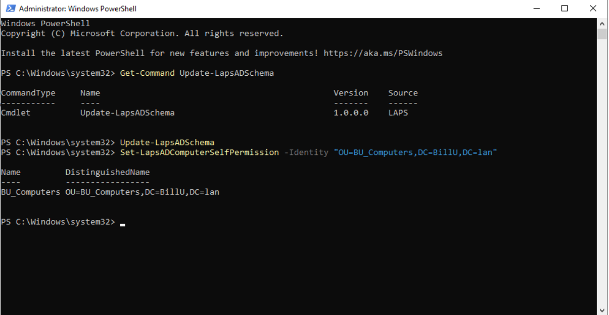
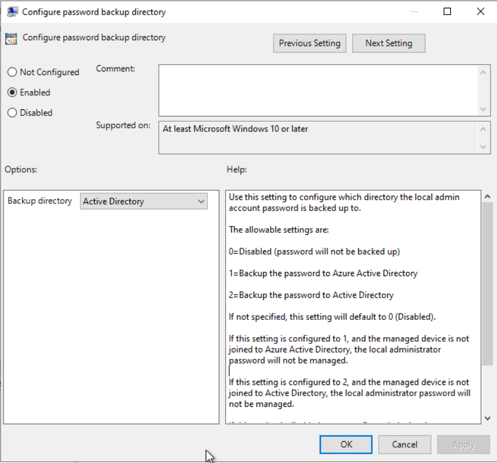
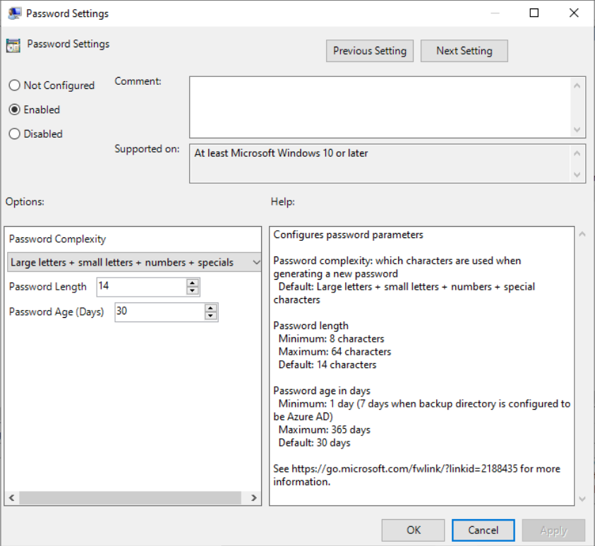
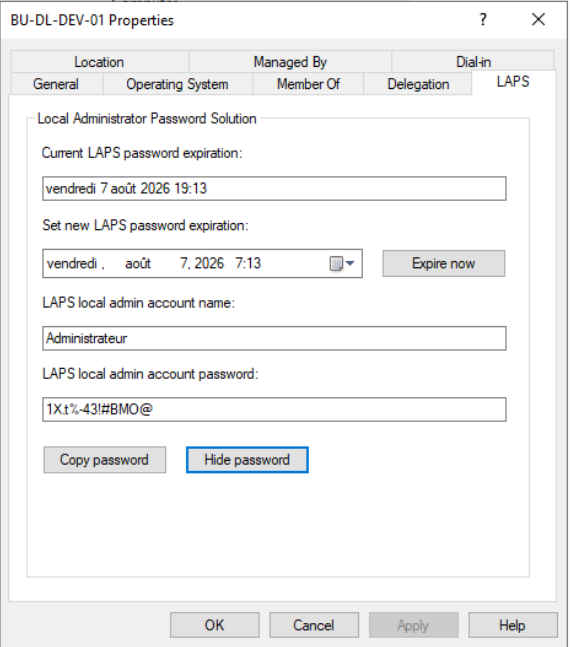
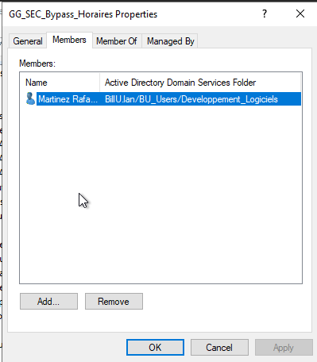
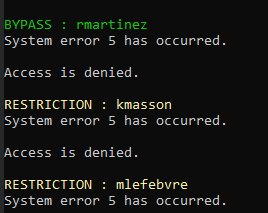
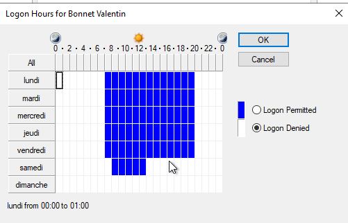
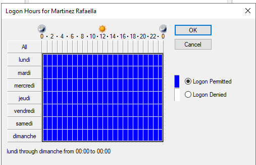
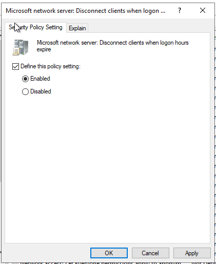
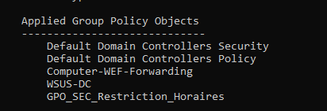

# Présentation du document 

- Ce document a pour but d'expliquer les étapes pour corriger les vulnérabilités détéctées suite aux différents audit de sécurité.
- De préference les ajustement seront fait dans l'ordre de priorité via GPO, sinon via PowerShell et pour finir via Interface Graphique.

# Table des matières

- [**1. Déploiement de Windows LAPS (GPO)**](#1-déploiement-de-windows-laps-gpo)
- [**2. Sécurisation par certificat auto signé**](#2-sécurisation-par-certificat-auto-signé)
- [**3. Déplacement automatique des ordinateurs dans les bonnes OU**](#3-déplacement-automatique-des-ordinateurs-dans-les-bonnes-ou)
- [**4. Sécurité d'accès Restriction d'utilisation**](#4-Sécurité-daccès-Restriction-dutilisation)
- [**5. Désactivation de la télémétrie**](#5-désactivation-de-la-télémétrie)
## 1. Déploiement de Windows LAPS (GPO)

### Description de la faille
Sans LAPS, le compte **Administrateur local** de chaque machine du domaine partage généralement le même mot de passe.
Si un attaquant compromet une machine, il peut utiliser ce mot de passe pour se connecter en administrateur local sur toutes les autres machines du domaine.
**Windows LAPS** (Local Administrator Password Solution) résout ce problème en générant automatiquement un mot de passe unique par machine, en le stockant chiffré dans l'AD et en le renouvelant à intervalles réguliers.

### Correction
### Etape 1 - Extension du schéma AD
A effectuer une seule fois sur le domaine depuis le DC détenant le rôle **Schema Master**.
```
- Vérifier quel DC détient le rôle Schema Master :
  netdom query fsmo
- Etendre le schéma AD pour Windows LAPS :
  Update-LapsADSchema
```
**Vérification :**
```
Get-ADObject -SearchBase (Get-ADRootDSE).SchemaNamingContext -Filter {name -like "ms-LAPS*"}
```
Les attributs suivants doivent apparaitre :
```
ms-LAPS-EncryptedDSRMPassword
ms-LAPS-EncryptedDSRMPasswordHistory
ms-LAPS-EncryptedPassword
ms-LAPS-EncryptedPasswordHistory
ms-LAPS-Password
ms-LAPS-PasswordExpirationTime
```
---
### Etape 2 - Délégation des permissions sur les OUs
Chaque machine doit avoir le droit d'écrire son propre mot de passe dans l'AD.
La commande suivante est à répéter sur chaque OU contenant des machines :
```
Set-LapsADComputerSelfPermission -Identity "OU=BU_Computers,DC=BillU,DC=lan"
```


---
### Etape 3 - Configuration de la GPO LAPS
**Nom de la GPO :** `GPO-LAPS-Postes-v1.0`
```
- Ouvrir la console GPMC (gpmc.msc)
- Lier la GPO à l'OU BU_Computers (ou Postes_Utilisateurs)
- Clic droit sur la GPO - Edit
- Computer Configuration
  - Policies
    - Administrative Templates
      - System
        - LAPS
```



**Parametre 1 - Configure password backup directory**
```
- Enabled
- Backup directory : Active Directory
```
**Parametre 2 - Password Settings**
```
- Enabled
- Password complexity : Large letters + small letters + numbers + special characters
- Password length : 14
- Password age (days) : 30
```
**Parametre 3 - Enable password encryption**
```
- Enabled
```
---
### Etape 4 - Application et vérification
```
- Lancer gpupdate /force sur les machines cibles
- Vérifier la génération du mot de passe depuis le DC :
  Get-LapsADPassword -Identity "NOM-DE-LA-MACHINE" -AsPlainText
```
**Résultat attendu :**
```
ComputerName     : NOM-DE-LA-MACHINE
Account          : Administrateur
Password         : xxxxxxxxxxxxxxx
Source           : EncryptedPassword
DecryptionStatus : Success
AuthorizedDecryptor : BILLU\Domain Admins
```
---
### Etape 5 - Documentation de la rotation
```
- Etat avant rotation :
  Get-LapsADPassword -Identity "NOM-DE-LA-MACHINE" -AsPlainText
- Forcer une rotation manuelle sur le client :
  Reset-LapsPassword
- Etat après rotation :
  Get-LapsADPassword -Identity "NOM-DE-LA-MACHINE" -AsPlainText
````


### Résultat
| Element | Avant | Après |
| --- | --- | --- |
| Mot de passe admin local | Identique sur toutes les machines | Unique par machine |
| Stockage du mot de passe | Non géré | Chiffré dans l'AD |
| Renouvellement | Manuel | Automatique tous les 30 jours |
| Accès au mot de passe | Non contrôlé | Réservé aux Domain Admins |
---

## 2. Sécurisation par certificat auto signé

### Description de la faille
Sans certificats TLS, les communications entre les clients et les serveurs web/mail transitent en **clair sur le réseau**.
Un attaquant positionné sur le réseau peut intercepter les identifiants, mots de passe et données sensibles échangés (attaque de type **Man-in-the-Middle**).

La mise en place d'une **PKI interne** (Public Key Infrastructure) basée sur **Windows Server AD CS** (Active Directory Certificate Services) résout ce problème en :
- Générant une **Autorité de Certification (CA) racine de confiance** intégrée à l'AD
- Distribuant automatiquement cette CA à tous les postes du domaine via les GPO
- Permettant d'émettre des certificats TLS signés pour chaque service exposé

---

### Déploiement de la PKI interne (AD CS)

### Etape 1 - Installation du rôle AD CS sur le contrôleur de domaine

 A effectuer depuis le DC principal (`BV-100-101.BillU.lan`) en PowerShell en tant qu'**Administrateur du domaine**.

```powershell
Install-WindowsFeature ADCS-Cert-Authority -IncludeManagementTools

Install-AdcsCertificationAuthority `
  -CAType EnterpriseRootCA `
  -CryptoProviderName "RSA#Microsoft Software Key Storage Provider" `
  -KeyLength 4096 `
  -HashAlgorithmName SHA256 `
  -CACommonName "BillU-CA" `
  -ValidityPeriod Years `
  -ValidityPeriodUnits 10
```

**Vérification :**
```powershell
Get-Service CertSvc
certutil -CAInfo
```

Les résultats attendus sont :
```
Running   CertSvc   Active Directory Certificate Services

CA name: BillU-CA
CA type: 0 -- Enterprise Root CA
CA cert[0]: 3 -- Valid
```

---

### Etape 2 - Installation du rôle Web Enrollment

Le rôle **Web Enrollment** expose une interface web (`/certsrv`) permettant de soumettre des demandes de signature de certificat (CSR) depuis n'importe quelle machine du réseau.

```powershell
Install-WindowsFeature ADCS-Web-Enrollment -IncludeManagementTools
Install-AdcsWebEnrollment
```

**Vérification :**

Depuis un navigateur sur le LAN :
```
http://BV-100-101.BillU.lan/certsrv
```
La page **"Microsoft Active Directory Certificate Services — BillU-CA"** doit s'afficher avec une demande d'authentification Windows.

---

### Etape 3 - Distribution automatique de la CA racine aux postes du domaine

Grâce au type **Enterprise CA**, le certificat racine `BillU-CA` est automatiquement distribué à tous les postes joints au domaine via les **Public Key Policies** de la **Default Domain Policy**.

**Vérification sur un poste client Windows :**
```powershell
gpupdate /force
certutil -store -enterprise Root | findstr "BillU-CA"
```

**Résultat attendu :**
```
================ Certificate 0 ================
Issuer: CN=BillU-CA, DC=BillU, DC=lan
```
---

### Déploiement des certificats TLS sur les serveurs (Debian/Apache)

La procédure suivante est **identique pour chaque serveur**. L'exemple ci-dessous utilise le serveur intranet (`interne.BillU.lan`). Adapter le nom pour chaque service.

### Etape 1 - Génération de la clé privée et du CSR

A effectuer **sur chaque serveur Debian** concerné.

```bash
# Créer le dossier SSL
sudo mkdir -p /etc/apache2/ssl
cd /etc/apache2/ssl

# Générer la clé privée (2048 bits)
sudo openssl genrsa -out interne.key 2048

# Générer le CSR avec le SAN
sudo openssl req -new -key interne.key -out interne.csr -subj "/C=FR/O=BillU/CN=interne.BillU.lan" -addext "subjectAltName=DNS:interne.BillU.lan"

# Sécuriser la clé privée
sudo chmod 600 interne.key
sudo chown root:root interne.key
```
---

### Etape 2 - Signature du CSR via l'interface Web Enrollment

- Depuis un navigateur sur le LAN, aller sur `http://BV-100-101.BillU.lan/certsrv`
- S'authentifier avec `BillU\Administrator`
- Cliquer sur **"Request a certificate"**
- Cliquer sur **"advanced certificate request"**
- Coller le contenu de `interne.csr` dans le champ **"Saved Request"**
- Sélectionner le template **"Web Server"**
- Cliquer sur **"Submit"**
- Sélectionner **"Base 64 encoded"**
- Télécharger **"Download certificate"** (`certnew.cer`)

---

### Etape 3 - Transfert et installation du certificat signé

**Depuis le PC Windows (PowerShell) :**
```powershell
scp C:\Users\VotreUser\Downloads\certnew.cer utilisateur@interne.BillU.lan:/tmp/
```

**Sur le serveur Debian :**
```bash
# Déplacer le certificat au bon endroit
sudo mv /tmp/certnew.cer /etc/apache2/ssl/interne.crt
sudo chmod 644 /etc/apache2/ssl/interne.crt
sudo chown root:root /etc/apache2/ssl/interne.crt

# Vérifier la correspondance clé privée / certificat (les deux hash doivent être identiques)
openssl rsa -noout -modulus -in /etc/apache2/ssl/interne.key | openssl md5
openssl x509 -noout -modulus -in /etc/apache2/ssl/interne.crt | openssl md5
```

**Résultat attendu :**
```
MD5(stdin)= 630f51ddb5272ea346e02de6dbc7083f
MD5(stdin)= 630f51ddb5272ea346e02de6dbc7083f
```

---

### Etape 4 - Configuration du VirtualHost Apache (HTTP + HTTPS)

```bash
sudo nano /etc/apache2/sites-available/interne.conf
```

```apache
<VirtualHost *:80>
    ServerName interne.BillU.lan
    DocumentRoot /var/www/html

    # Redirection automatique vers HTTPS
    RewriteEngine On
    RewriteCond %{HTTPS} off
    RewriteRule ^ https://%{HTTP_HOST}%{REQUEST_URI} [L,R=301]

    ErrorLog ${APACHE_LOG_DIR}/interne_error.log
    CustomLog ${APACHE_LOG_DIR}/interne_access.log combined
</VirtualHost>

<VirtualHost *:443>
    ServerName interne.BillU.lan
    DocumentRoot /var/www/html

    SSLEngine on
    SSLCertificateFile /etc/apache2/ssl/interne.crt
    SSLCertificateKeyFile /etc/apache2/ssl/interne.key

    ErrorLog ${APACHE_LOG_DIR}/interne_ssl_error.log
    CustomLog ${APACHE_LOG_DIR}/interne_ssl_access.log combined
</VirtualHost>
```

```bash
# Activer les modules et le site
sudo a2enmod ssl rewrite
sudo a2ensite interne.conf
sudo a2dissite 000-default.conf

# Vérifier la syntaxe et redémarrer
sudo apache2ctl configtest
sudo systemctl restart apache2
```
---

### Etape 5 - Vérification finale

**Vérification côté serveur :**
```bash
curl -v http://interne.BillU.lan/ 2>&1 | grep "HTTP\|Location"
echo | openssl s_client -connect interne.BillU.lan:443 -servername interne.BillU.lan 2>/dev/null | openssl x509 -noout -subject -issuer -dates
```

**Résultat attendu :**
```
HTTP/1.1 301 Moved Permanently
Location: https://interne.BillU.lan/

subject=C=FR, O=BillU, CN=interne.BillU.lan
issuer=DC=lan, DC=BillU, CN=BillU-CA
notBefore=Jun 17 17:30:54 2026 GMT
notAfter=Jun 16 17:30:54 2028 GMT
```

**Vérification navigateur :**

Depuis un poste Windows joint au domaine, ouvrir `https://interne.BillU.lan` — le cadenas doit être fermé sans aucune alerte de sécurité.

---

### Récapitulatif des services sécurisés

| Serveur | Zone | URL | Certificat | Redirection HTTP→HTTPS |
|---|---|---|---|---|
| Intranet | LAN | `https://interne.BillU.lan` | `BillU-CA` | ✅ |
| Vitrine | DMZ | `https://www.BillU.lan` | `BillU-CA` | ✅ |
| Webmail | DMZ | `https://mail.BillU.lan/mail` | `BillU-CA` | — |
| GLPI | LAN | `https://glpi.BillU.lan` | `BillU-CA` | ✅ |

---

## 5. Cas particulier : serveurs en DMZ

Les serveurs en DMZ ne peuvent pas accéder directement à `/certsrv` par défaut, car la règle **"Deny All DMZ > LAN"** bloque l'ensemble du trafic entre les deux zones.

Des règles **spécifiques et restrictives** doivent être ajoutées dans pfSense pour autoriser uniquement les flux nécessaires :

| Source | Destination | Port | Protocole | Justification |
|---|---|---|---|---|
| IP serveur DMZ | `172.16.130.253` | 53 | TCP/UDP | Résolution DNS interne |
| IP serveur DMZ | `172.16.130.253` | 80 | TCP | Accès à `/certsrv` |

Ces règles doivent être placées **avant** la règle "Deny All DMZ > LAN" dans l'ordre d'évaluation pfSense.

**Vérification de la connectivité depuis le serveur DMZ :**
```bash
nslookup BV-100-101.BillU.lan
curl -v http://BV-100-101.BillU.lan/certsrv 2>&1 | head -5
```

**Résultat attendu :**
```
Server: 172.16.130.253
HTTP/1.1 401 Unauthorized
Server: Microsoft-IIS/10.0
```

---

### Résultat

| Elément | Avant | Après |
|---|---|---|
| Protocole des échanges | HTTP (clair) | HTTPS (chiffré TLS 1.2/1.3) |
| Certificat | Absent ou auto-signé (alerte navigateur) | Signé par `BillU-CA` (confiance automatique) |
| Distribution de la confiance | Manuelle (import poste par poste) | Automatique via GPO (Enterprise CA) |
| Visibilité des identifiants sur le réseau | En clair (interceptable) | Chiffrés (non lisibles) |
| Redirection HTTP → HTTPS | Absente | Active (301 Permanent) |

## 3. Déplacement automatique des ordinateurs dans les bonnes OU

### Description du besoin
Lorsqu'une machine est jointe au domaine, son objet ordinateur est créé dans le conteneur par défaut `CN=Computers,DC=BillU,DC=lan`.
Ce conteneur n'est **pas une OU** : il est impossible d'y lier des GPO. Tant que les machines y restent, elles échappent aux stratégies de groupe (LAPS, durcissement, mappages...) et l'annuaire perd sa cohérence.

La solution mise en place consiste en un **script PowerShell** exécuté périodiquement par une **tâche planifiée**, qui trie automatiquement les machines vers leur OU définitive selon deux critères :

- Le **préfixe du nom** de la machine (critère prioritaire)
- La **valeur de l'attribut AD** `description` (critère de repli)

**Critères de tri retenus :**

| Critère | Valeur | OU de destination |
| --- | --- | --- |
| Nom `BV-*` | Serveur | `OU=Serveurs,OU=BU_Computers,DC=BillU,DC=lan` |
| Nom `PC-*` | Poste utilisateur | `OU=Postes_Utilisateurs,OU=BU_Computers,DC=BillU,DC=lan` |
| Nom `ADM-*` | Machine d'administration | `OU=Computers_Admins,OU=BU_Admins,DC=BillU,DC=lan` |
| Attribut `description` contient `Serveur` | Serveur | `OU=Serveurs,OU=BU_Computers,DC=BillU,DC=lan` |
| Attribut `description` contient `Poste` | Poste utilisateur | `OU=Postes_Utilisateurs,OU=BU_Computers,DC=BillU,DC=lan` |
| Attribut `description` contient `Admin` | Machine d'administration | `OU=Computers_Admins,OU=BU_Admins,DC=BillU,DC=lan` |


### Mise en place

### Etape 1 - Dépôt des scripts
Copier les deux scripts sur le contrôleur de domaine :

```
C:\Scripts\
├── Move-ComputersToOU.ps1        -> script de tri (exécuté par la tâche planifiée)
├── Setup-TaskAndRecycleBin.ps1   -> script d'installation (exécuté une seule fois)
└── Logs\                          -> journaux (créé automatiquement)
```

Le script `Move-ComputersToOU.ps1` est documenté (bloc d'aide `.SYNOPSIS` / `.DESCRIPTION`) et paramétré en tête de fichier :

```
- $TestMode        : $true
- $SourceOU        : CN=Computers,DC=BillU,DC=lan
- $RulesByName     : table de correspondance préfixe -> OU cible
- $AttributeName   : attribut AD inspecté (description)
- $RulesByAttribute: table de correspondance valeur -> OU cible
- $Priority        : "Name" (le nom prime sur l'attribut)
```

---

### Etape 2 - Test du script en mode simulation
Avant toute mise en production, le script est exécuté avec `$TestMode = $true` : aucun objet n'est réellement déplacé, chaque décision est tracée avec la mention `[SIMULATION]`.

```
- Créer des machines de test dans le conteneur Computers :
  New-ADComputer -Name "PC-TEST-01" -Path "CN=Computers,DC=BillU,DC=lan"
  New-ADComputer -Name "BV-TEST-01" -Path "CN=Computers,DC=BillU,DC=lan"

- Lancer le script manuellement :
  .\Move-ComputersToOU.ps1

- Consulter le journal :
  Get-Content C:\Scripts\Logs\MoveComputers_$(Get-Date -Format "yyyy-MM-dd").log
```

**Résultat attendu dans le log :**
```
2026-06-10 20:15:03 [INFO] ===== Début du traitement (TestMode = True) =====
2026-06-10 20:15:04 [TEST] PC-TEST-01 : [SIMULATION] serait déplacé vers OU=Postes_Utilisateurs,OU=BU_Computers,DC=BillU,DC=lan
2026-06-10 20:15:04 [TEST] BV-TEST-01 : [SIMULATION] serait déplacé vers OU=Serveurs,OU=BU_Computers,DC=BillU,DC=lan
2026-06-10 20:15:04 [INFO] ===== Fin : 2 déplacé(s), 0 ignoré(s), 0 erreur(s) =====
```

Une fois le comportement validé, passer `$TestMode = $false` dans le script.

---

## Tâche planifiée d'automatisation

### Description
L'énoncé prévoit une automatisation « par tâche AT ». Grâce au **Planificateur de tâches**, utilisé ici via les cmdlets PowerShell `ScheduledTasks`. La tâche exécute le script de tri toutes les heures avec le compte `SYSTEM`.

### Mise en place

### Etape 1 - Création de la tâche
La tâche est créée automatiquement par le script d'installation :

```
- Ouvrir une console PowerShell en administrateur :
  cd C:\Scripts
  .\Setup-TaskAndRecycleBin.ps1
```

**Caractéristiques de la tâche créée :**
```
Nom          : AD - Deplacement automatique des ordinateurs
Action       : powershell.exe -NoProfile -ExecutionPolicy Bypass -File "C:\Scripts\Move-ComputersToOU.ps1"
Déclencheur  : toutes les heures (répétition sur 10 ans)
Compte       : SYSTEM (RunLevel Highest)
Options      : StartWhenAvailable, limite d'exécution 30 min
```
---

### Etape 2 - Vérification de la tâche

```
Get-ScheduledTask -TaskName "AD - Deplacement automatique des ordinateurs"
```

**Résultat attendu :**
```
TaskPath   TaskName                                        State
--------   --------                                        -----
\          AD - Deplacement automatique des ordinateurs    Ready
```

---

### Etape 3 - Test fonctionnel de bout en bout

```
- Déclencher la tâche immédiatement (sans attendre l'heure suivante) :
  Start-ScheduledTask -TaskName "AD - Deplacement automatique des ordinateurs"

- Vérifier le déplacement effectif des machines de test :
  Get-ADComputer "PC-TEST-01" | Select-Object Name, DistinguishedName
  Get-ADComputer "BV-TEST-01" | Select-Object Name, DistinguishedName
```

**Résultat attendu :**
```
Name        DistinguishedName
----        -----------------
PC-TEST-01  CN=PC-TEST-01,OU=Postes_Utilisateurs,OU=BU_Computers,DC=BillU,DC=lan
BV-TEST-01  CN=BV-TEST-01,OU=Serveurs,OU=BU_Computers,DC=BillU,DC=lan
```
---


## Résultat

| Element | Avant | Après |

| --- | --- | --- |
| Placement des ordinateurs | Manuel, machines oubliées dans CN=Computers | Automatique selon nom (`BV-`/`PC-`/`ADM-`) et attribut `description` |
| Application des GPO machines | Impossible dans le conteneur Computers | Garantie dès le tri dans les OU |
| Fréquence du tri | Aucune | Toutes les heures (tâche planifiée, compte SYSTEM) |
| Traçabilité | Aucune | Journal quotidien dans C:\Scripts\Logs |


## 4. Sécurité d'accès Restriction d'utilisation

Description de la faille

Sans restriction horaire, un utilisateur standard peut se connecter au domaine à n'importe quel moment, y compris en dehors des horaires de travail.

Cela représente un risque de sécurité, car un compte compromis pourrait être utilisé la nuit, le week-end ou en dehors des périodes normales d'activité sans être immédiatement détecté.

L'objectif est donc de limiter les connexions des utilisateurs standards aux plages horaires autorisées, tout en conservant un accès permanent pour les administrateurs et pour certains utilisateurs d'exception.

Objectif

Mettre en place une restriction d'utilisation des comptes Active Directory selon les règles suivantes :

Utilisateurs standards :
- Lundi au vendredi : 07h00 - 20h00
- Samedi : 08h00 - 13h00
- Dimanche : connexion interdite
- Administrateurs
- Bypass total
- Groupe d'exception
- GG_SEC_Bypass_Horaires

Les utilisateurs membres de ce groupe ne sont pas soumis aux restrictions horaires.

Correction

La correction repose sur trois éléments :

création d'un groupe d'exception dans Active Directory ;
application automatique des horaires de connexion avec un script PowerShell ;
création d'une GPO permettant de renforcer la restriction horaire.

### Étape 1 - Création du groupe d'exception

Un groupe de sécurité global a été créé afin de gérer les utilisateurs autorisés à contourner la restriction horaire.

Emplacement du groupe :

BillU.lan
→ BU_Groups

Nom du groupe :

GG_SEC_Bypass_Horaires

Type du groupe :

Security Group - Global

Ce groupe permet de gérer les exceptions sans modifier manuellement chaque utilisateur.

L'utilisateur Martinez a été ajouté dans ce groupe afin de tester le bypass.



### Étape 2 - Application automatique des horaires avec PowerShell

Afin d'éviter de configurer les plages horaires utilisateur par utilisateur, un script PowerShell a été utilisé.

Le script cible uniquement les utilisateurs présents dans l'OU :

OU=BU_Users,DC=BillU,DC=lan

Les administrateurs ne sont pas impactés, car ils sont stockés dans une autre OU :

OU=BU_Admins,DC=BillU,DC=lan

Le script applique les horaires suivants aux utilisateurs standards :

Lundi au vendredi : 07h00 - 20h00
Samedi : 08h00 - 13h00
Dimanche : interdit

Les utilisateurs membres du groupe GG_SEC_Bypass_Horaires sont configurés avec un accès autorisé tout le temps.

Script utilisé :
````
Import-Module ActiveDirectory

# OU contenant les utilisateurs standards
$UsersOU = "OU=BU_Users,DC=BillU,DC=lan"

# Groupe d'exception qui garde un accès complet
$BypassGroup = "GG_SEC_Bypass_Horaires"

# Récupération des membres du groupe bypass
$BypassMembers = Get-ADGroupMember -Identity $BypassGroup -Recursive |
    Where-Object { $_.objectClass -eq "user" } |
    Select-Object -ExpandProperty SamAccountName

# Récupération de tous les utilisateurs standards dans BU_Users et ses sous-OU
$Users = Get-ADUser -SearchBase $UsersOU -Filter * -Properties SamAccountName

foreach ($User in $Users) {

    if ($BypassMembers -contains $User.SamAccountName) {
        Write-Host "BYPASS : $($User.SamAccountName)" -ForegroundColor Green
        net user "$($User.SamAccountName)" /domain /time:all
    }
    else {
        Write-Host "RESTRICTION : $($User.SamAccountName)" -ForegroundColor Yellow
        net user "$($User.SamAccountName)" /domain /time:"M-F,7am-8pm;Sa,8am-1pm"
    }
}
````
Commande utilisée pour exécuter le script :

Set-ExecutionPolicy -Scope Process -ExecutionPolicy Bypass
.\bypass.ps1

Résultat attendu :

RESTRICTION : Andersson
BYPASS : Martinez




### Étape 3 - Vérification des horaires sur un utilisateur standard

L'utilisateur Andersson a été utilisé pour tester la restriction horaire.

Andersson est un utilisateur standard et ne fait pas partie du groupe GG_SEC_Bypass_Horaires.

Depuis Active Directory Users and Computers :

Utilisateur Andersson
→ Properties
→ Account
→ Logon Hours

Les horaires appliqués sont les suivants :

Lundi au vendredi : 07h00 - 20h00
Samedi : 08h00 - 13h00
Dimanche : interdit




### Étape 4 - Vérification du bypass groupe d'exception

L'utilisateur Martinez a été ajouté au groupe :

GG_SEC_Bypass_Horaires

Après exécution du script, Martinez conserve un accès autorisé tout le temps.

Depuis Active Directory Users and Computers :

Utilisateur Martinez
→ Properties
→ Account
→ Logon Hours

Résultat attendu :

Logon permitted sur toutes les plages horaires




### Étape 5 - Création de la GPO

Une GPO a été créée afin de documenter et renforcer la stratégie de restriction horaire.

Nom de la GPO :

GPO_SEC_Restriction_Horaires

Chemin de configuration :

Computer Configuration
→ Policies
→ Windows Settings
→ Security Settings
→ Local Policies
→ Security Options

Paramètre configuré :

Microsoft network server: Disconnect clients when logon hours expire

Valeur appliquée :

Enabled



Cette GPO permet de déconnecter les sessions réseau lorsque les horaires de connexion autorisés sont dépassés.


### Étape 6 - Application de la GPO

La GPO a été appliquée sur les postes concernés avec la commande :

gpupdate /force

La vérification de l'application de la GPO a été réalisée avec :

gpresult /r

La GPO GPO_SEC_Restriction_Horaires doit apparaître dans la liste des stratégies appliquées.




### Étape 7 - Test de connexion hors plage horaire avec un utilisateur standard

L'utilisateur Andersson a tenté de se connecter en dehors de la plage horaire autorisée.

Résultat attendu :

Connexion refusée

Résultat obtenu :

Connexion refusée avec un message indiquant une restriction horaire

Le test est validé.


### Étape 8 - Test de bypass avec un utilisateur du groupe d'exception

L'utilisateur Martinez, membre du groupe GG_SEC_Bypass_Horaires, a tenté de se connecter en dehors de la plage horaire standard.

Résultat attendu :

Connexion autorisée

Résultat obtenu :

Connexion réussie

Le test est validé.


### Étape 9 - Test de bypass administrateur

Un compte administrateur a été testé en dehors de la plage horaire autorisée pour les utilisateurs standards.

Les comptes administrateurs ne sont pas impactés par le script, car celui-ci cible uniquement l'OU :

OU=BU_Users,DC=BillU,DC=lan

Résultat attendu :

Connexion autorisée

Résultat obtenu :

Connexion réussie

Le test est validé.


## Résultat

| Élément | Avant correction | Après correction |
|---|---|---|
| Utilisateurs standards | Connexion possible à tout moment | Connexion limitée aux horaires autorisés |
| Horaires semaine | Non définis | Lundi au vendredi, 07h00 - 20h00 |
| Horaires samedi | Non définis | Samedi, 08h00 - 13h00 |
| Dimanche | Connexion possible | Connexion interdite |
| Administrateurs | Connexion possible | Bypass total conservé |
| Groupe d'exception | Non présent | GG_SEC_Bypass_Horaires créé et fonctionnel |
| GPO | Non configurée | GPO_SEC_Restriction_Horaires configurée |
| Test utilisateur standard | Non testé | Andersson bloqué hors plage horaire |
| Test bypass | Non testé | Martinez autorisée grâce au groupe d'exception |

## Conclusion

La restriction d'utilisation est opérationnelle.

Les utilisateurs standards sont désormais limités aux plages horaires autorisées :

- Lundi au vendredi : 07h00 - 20h00
- Samedi : 08h00 - 13h00
- Dimanche : connexion interdite

L'utilisateur Andersson, qui ne fait pas partie du groupe de bypass, a bien été bloqué hors plage horaire.

L'utilisateur Martinez, membre du groupe GG_SEC_Bypass_Horaires, a pu se connecter grâce au bypass.

Les administrateurs disposent également d'un bypass total, car ils ne sont pas concernés par le script appliqué à l'OU BU_Users.

L'objectif de sécurité d'accès est donc validé.

## Désactivation de la télémétrie
