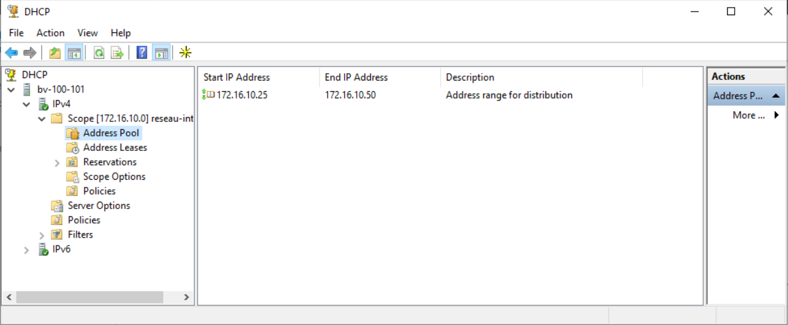
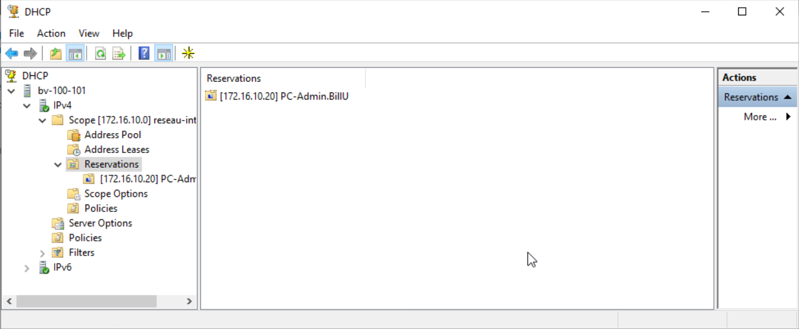

## Installation et configuration du rôle DHCP

Pour commencer on va ajouter sur notre serveur Windows 2022 le role DHCP:

 Dans manage on va selectionner add Roles and features. Puis on va suivre l'assistant jusqu'a la selection des rôles:

 

 Puis une fois le rôle ajouté on va aller dans Tools:

 

 Puis on choisi DHCP.
 Une fois dans le DHCP manage on va faire un clic droit sur notre serveur et ajouter un nouveau scope:

 

 Cela va nous permettre de selectionner la plage ip que l'on souhaite configurer ainsi que l'adresse de la passerelle par default et la reservation de plages ip si on en a besoin.

 Enfin on va réserver des adresses fixes pour nos serveurs en allant dans Réservation puis en ajoutant une nouvelle réservation d'ip:

 
