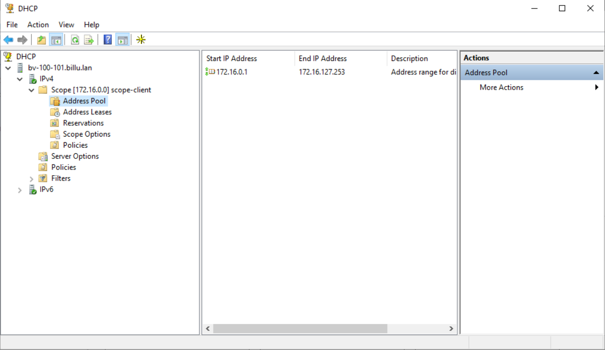
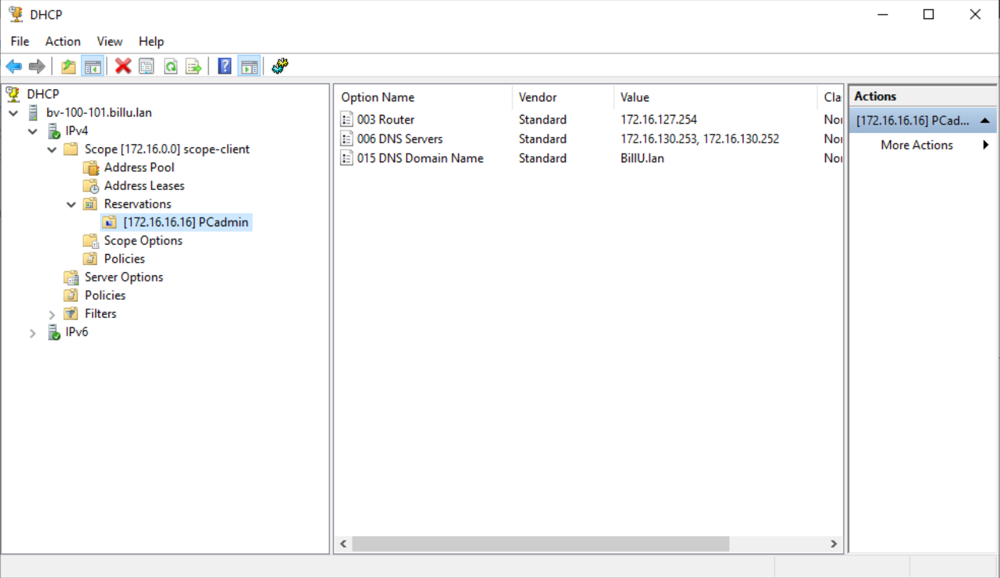

## Scope ##

Pour ce qui est de la configurationdu DHCP nous avons opté pour un scope unique pour les postes clients:

Les serveurs etant tous sur des ip fixes nous avons fait le choix de ne pas configurer de plage dhcp pour la partie serveur.

Toutefois nous avons fait une reservation pour le PC d'administration afin que celui ci ait une adresse fixe reservée:

Si notre infrastructure est amenée à evoluer nous pourrons faire d'autres reservations et d'autres scope sans problèmes.
