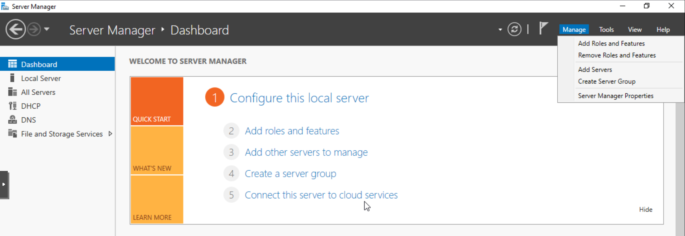
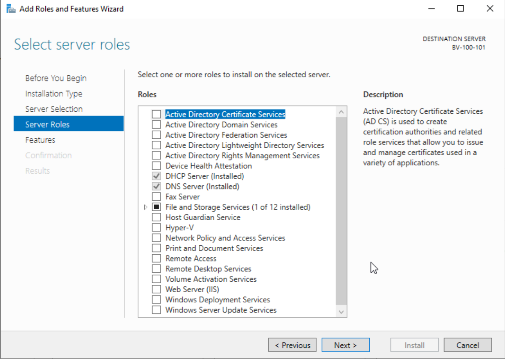
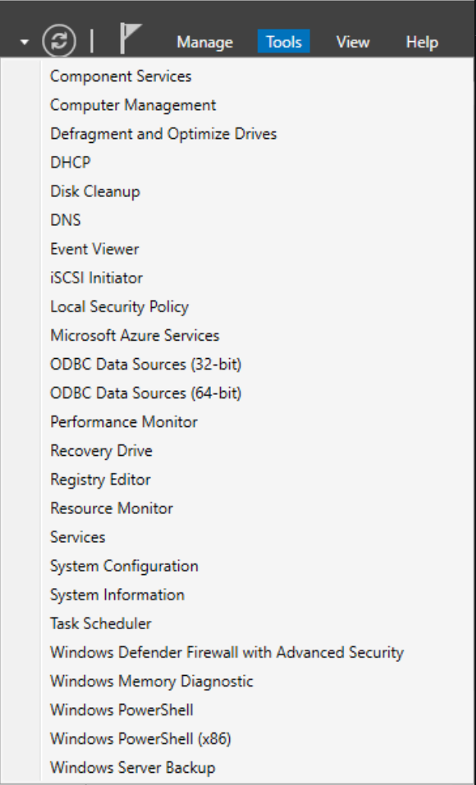
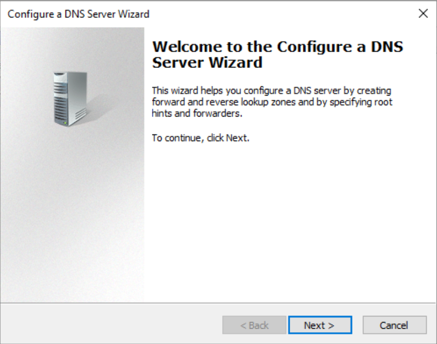
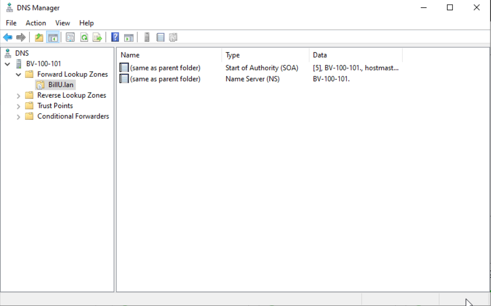
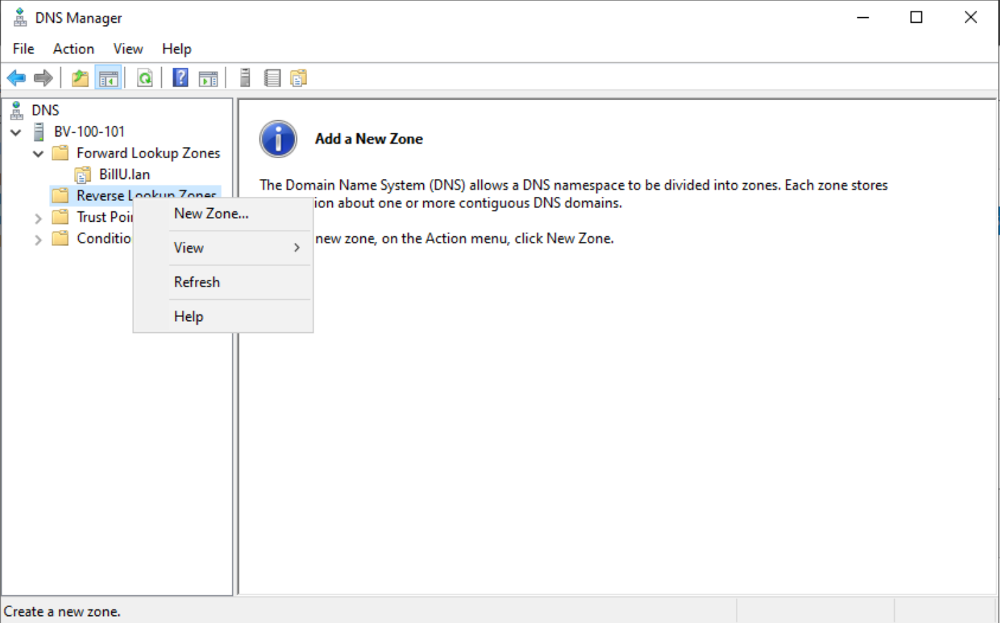

## Installation et configuration du rôle DHCP

Pour commencer on va ajouter sur notre serveur Windows 2022 le role DNS:

 Dans manage on va selectionner add Roles and features. Puis on va suivre l'assistant jusqu'a la selection des rôles:

 

 Puis une fois le rôle ajouté on va aller dans Tools:

 

 Puis on choisi DNS.
 Une fois dans le DNS manage on va faire un clic droit sur New Zone et suivre l'assistant afin de configurer notre zone:

 

 Cela va nous permettre de créer notre première zone et notre premier enregistrement A. Cela va servir de base à notre forêt AD

On va pouvoir aussi parametrer une zone reverse et des CNAME pour notre reseau (aucun à ce jour):

