# Sommaire
- [**1.Connexion à l'interface Web**](#1-connexion-à-linterface-web)
  - [**1.1 Accès à l'interface web**](#11-accès-à-linterface-web)
  - [**1.2 Identifiant de connexion par défaut**](#12-identifiant-de-connexion-par-défaut)
- [**2. Sécurisation post-installation**](#2-sécurisation-post-installation)
  - [**2.1 Création du compte**](#21-création-du-compte)
  - [**2.2 Création de l'utilisateur Super-Admin**](#22-création-de-lutilisateur-super-admin)
  - [**2.3 Connexion avec le compte Super-Admin**](#23-connexion-avec-le-compte-super-admin)
  - [**2.4 Désactivation des comptes par défaut**](#24-désactivation-des-comptes-par-défaut)
- [**3. Synchronisation GLPI avec Active Directory**](#3-synchronisation-glpi-avec-active-directory)
  - [**3.1 Création d'un compte GLPI dans Active Directory**](#31-création-dun-compte-glpi-dans-active-directory)
  - [**3.2 Configuration de l'annuaire LDAP dans GLPI**](#32-configuration-de-lannuaire-ldap-dans-glpi)
  - [**3.3 Test de la connexion**](#33-test-de-la-connexion)
  - [**3.4 Synchronisation des utilisateurs**](#34-synchronisation-des-utilisateurs)
- [**4. Installation de GLPI Agent**](#4-installation-de-glpi-agent)

# 1. Connexion à l'interface Web

## 1.1 Accès à l'interface web

Ouvrir un navigateur et taper : 

```
http://ADRESSE_IP_DU_SERVEUR_GLPI/ soit http://172.16.10.251
```

## 1.2 Identifiant de connexion par défaut

- Entrer les identifiants 
- Lors de la première connexion, les identifiants sont les suivants : 
  - **Compte super-administrateur** : `glpi` / `glpi`
  - **Compte administrateur** : `tech` / `tech`
  - **Compte normal** : `normal` / `normal`
  - **Compte post-only** : `post-only` / `postonly`
- Sélectionner **Base interne GLPI**
- Cliquer sur **Se connecter** 

# 2. Sécurisation post-installation

Comme tous les comptes ont les meme **ID** et **MDP** de base, nous allons créer un compte **Super-Admin**

## 2.1 Création du compte 

- Cliquer sur ``Administration > Utilisateurs > +``

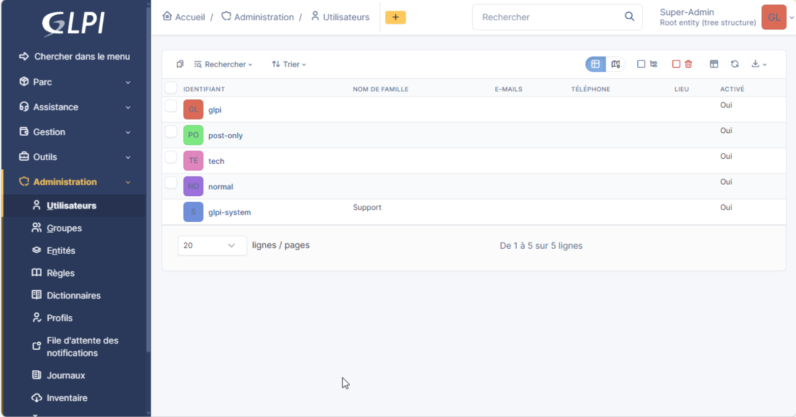

## 2.2 Création de l'utilisateur Super-Admin

- **Identifiant** : ``administrator_glpi``
- **Mot de passe** : ``Azerty1*``
- **Entité** : ``Root entity``
- **Récursif** : ``Oui``
- Cliquer sur ``Ajouter``

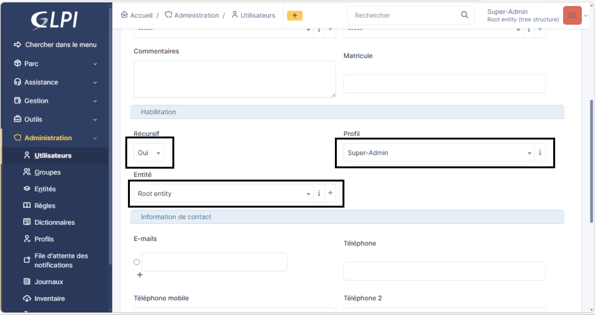

- Vérification de l'apparition de l'entité 

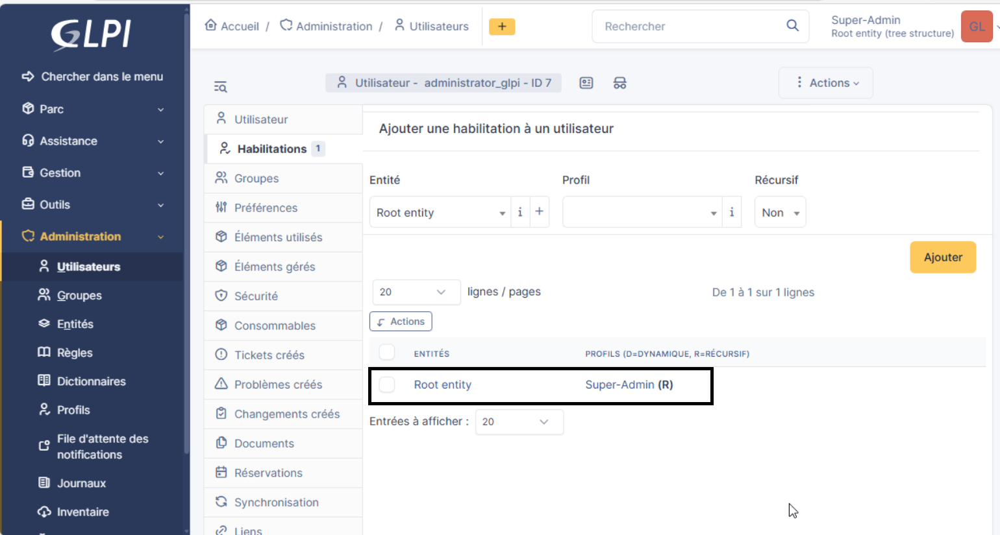

## 2.3 Connexion avec le compte Super-Admin

- Cliquer sur l'icone de votre compte en haut à droite
- Cliquer sur **déconnexion**
- Se reconnecter avec le compte qui a été crée 

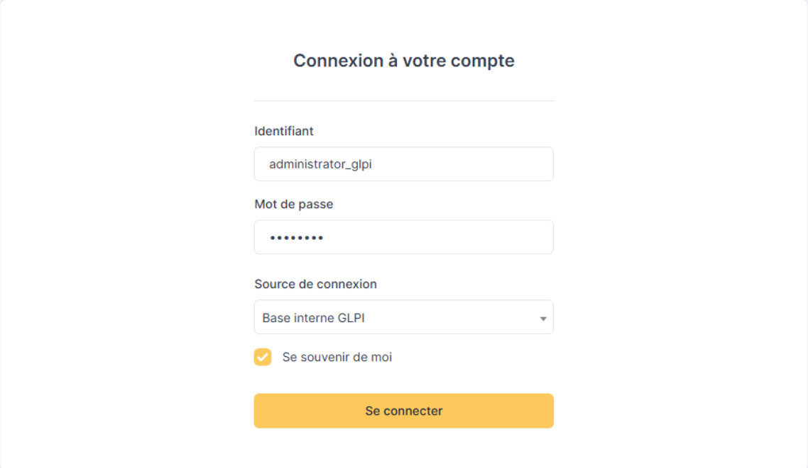

## 2.4 Désactivation des comptes par défaut

- Cliquer sur **Administration**
- Puis **Utilisateurs**

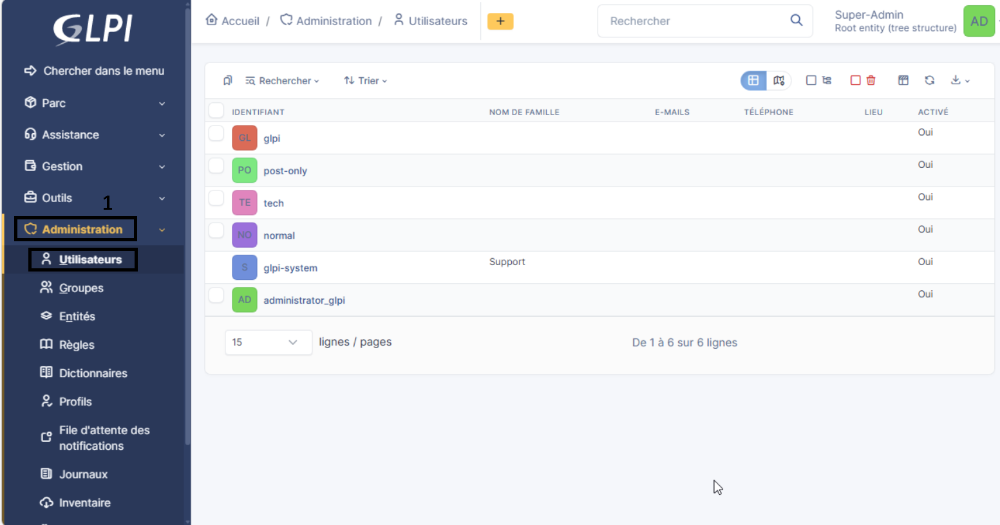

- Pour les 4 utilisateurs :
  - **glpi**
  - **post-only**
  - **tech**
  - **normal**
- Cliquer sur un utilisateur
- Mettre ``Non`` dans l'option ``Activité``
- Cliquer sur ``Sauvegarder`` 

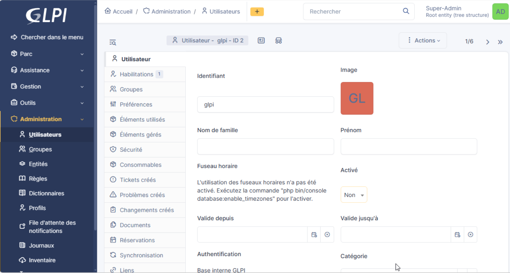

- Résultat final

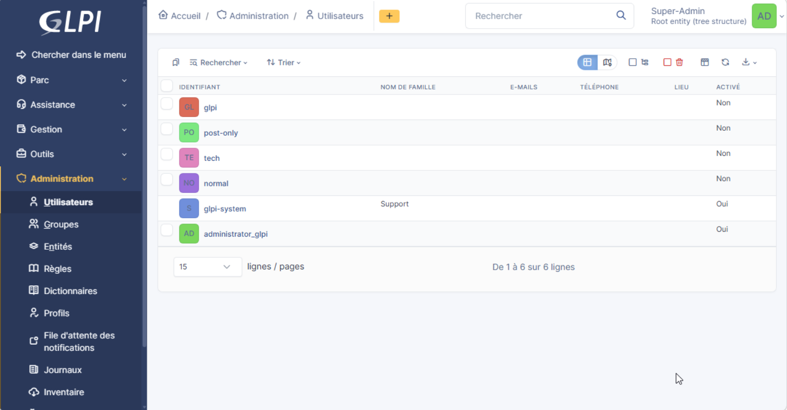

# 3. Synchronisation GLPI avec Active Directory

## 3.1 Création d'un compte GLPI dans Active Directory

- Au préalable il faudra créer un utilisateur , ici ``SVC_GLPI`` avec le mot de passe ``Azerty1*`` dans l'**AD**

## 3.2 Configuration de l'annuaire LDAP dans GLPI

- Cliquer sur **Configuration**
- Cliquer sur **Authentification**
- Cliquer sur **Annuaire LDAP**

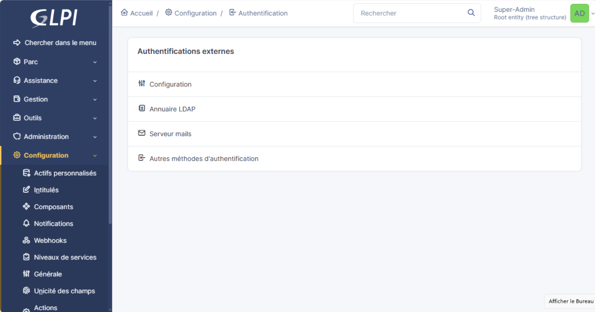

- Entrer le nom de l'annuaire ``Active Directory BillU`` 
- Sélectionner ``Oui`` pour `` Serveur par défaut``
- Sélectionner ``Oui`` pour ``Activé``
- Entrer l'adresse IP du serveur AD ``172.16.10.253``
- Entrer le filtre ``(objectClass=user)
- Entrer la base DN ``dc=billu,dc=lan``
- Entrer le compte GLPI créer sur l'ad ``SVC_GLPI@billu.lan``
- Entrer le mot de passe du compte ``Azerty1*``
- Entrer ``samaccountname`` dans ``Champ de l'identifiant``
- Entrer ``objectguid`` dans ``Champ de synchronisation``
- Cliquer sur ``Ajouter``

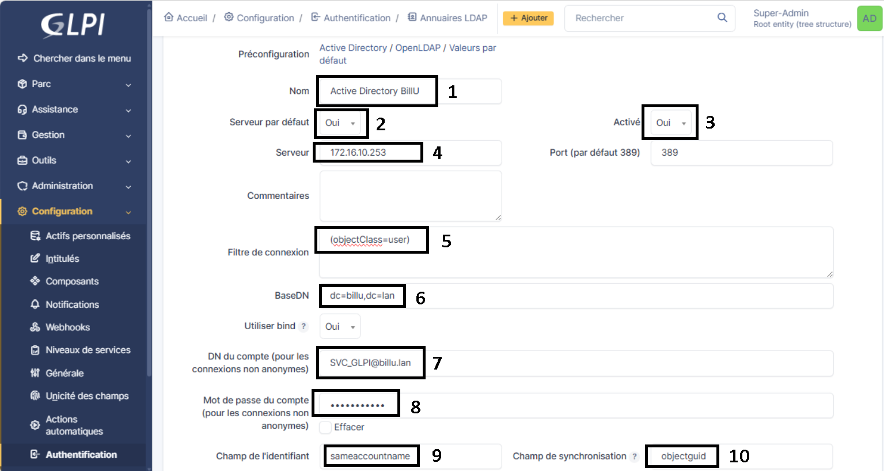

## 3.3 Test de la connexion

- Aller dans l'onglet **Tester** pour vérifier que la connexion est établie

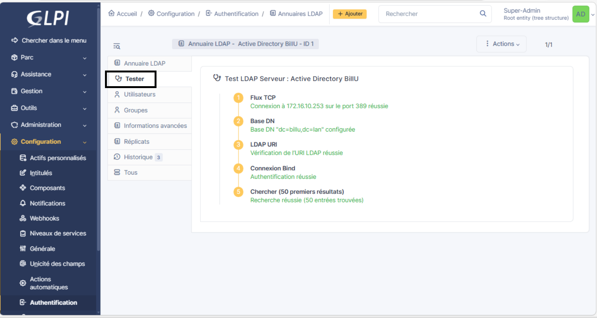

## 3.4 Synchronisation des utilisateurs

- Dans l'onglet **Administration** > **Utilisateurs**
  - Si **Liaison annuaire LDAP** n'apparait pas, suivre les étapes 
   - Cliquer sur l'utilisateur en haut à droite
   - Cliquer sur le rôle de l'utilisateur 
   - Liaison annuaire LDAP apparaitra , cliquer dessus

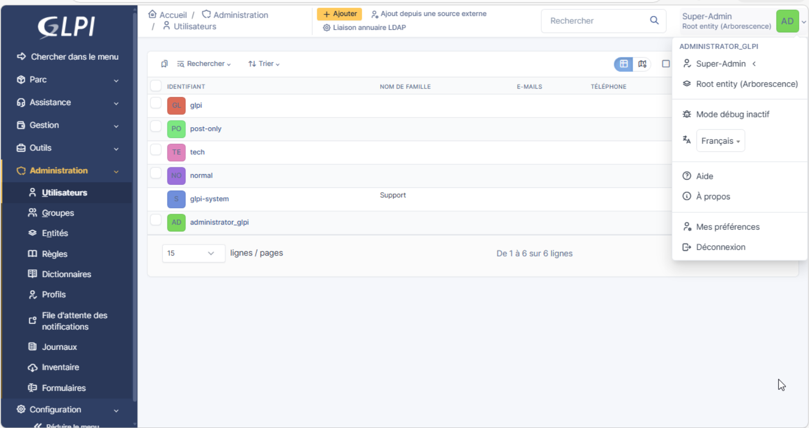

- Cliquer sur **Importation de nouveaux utilisateurs**

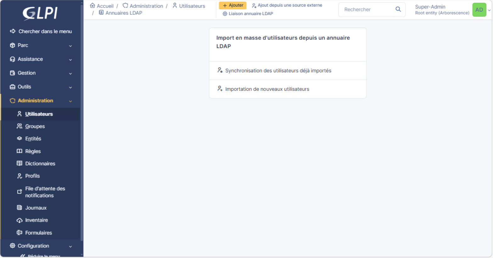

- Cliquer sur **Rechercher**

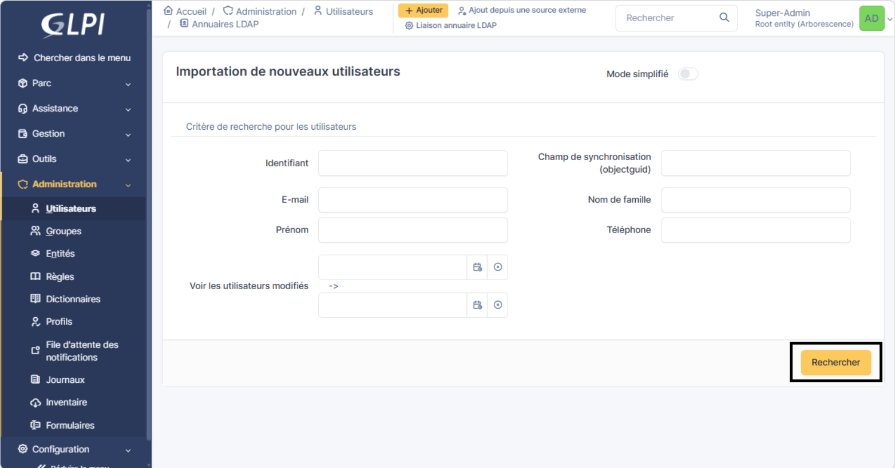

- Modifier le nombre de **lignes/pages** à ``1000``
- Cocher la case à gauche du ``Champ de synchronisation`` pour sélectionner tous les utilisateurs
- Cliquer sur ``Actions``

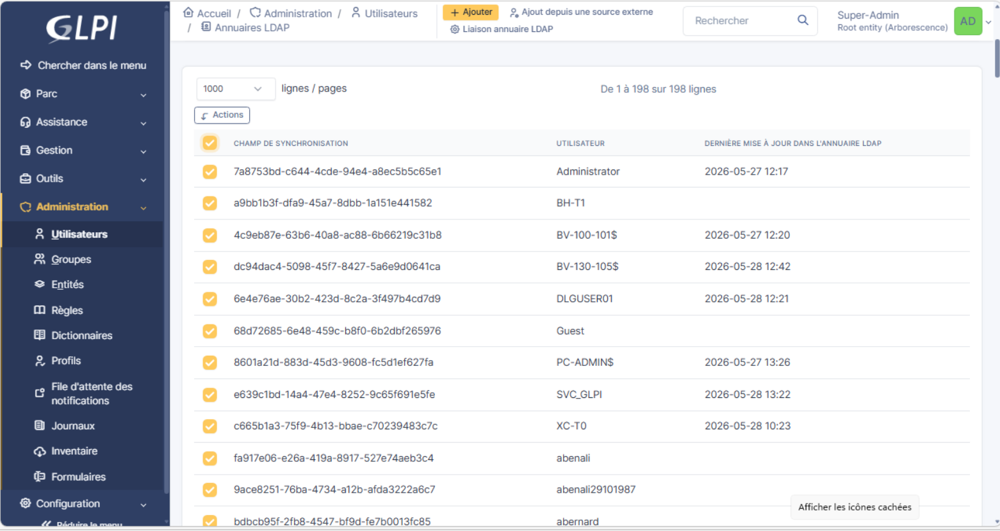

- Sélectionner ``Importer``
- Cliquer sur ``Envoyer``

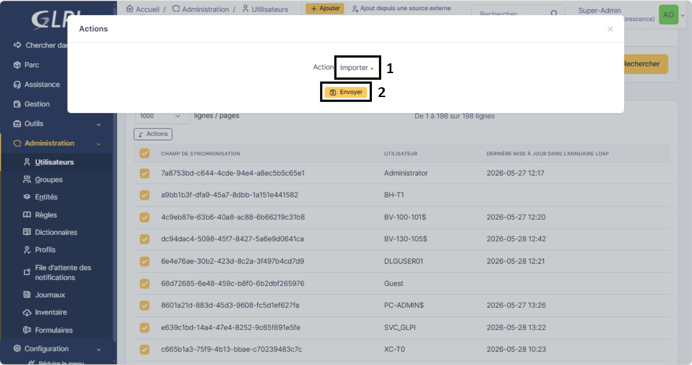

- La liste des utilisateurs apparaîtra dans ``Administration`` > ``Utilisateurs`` 

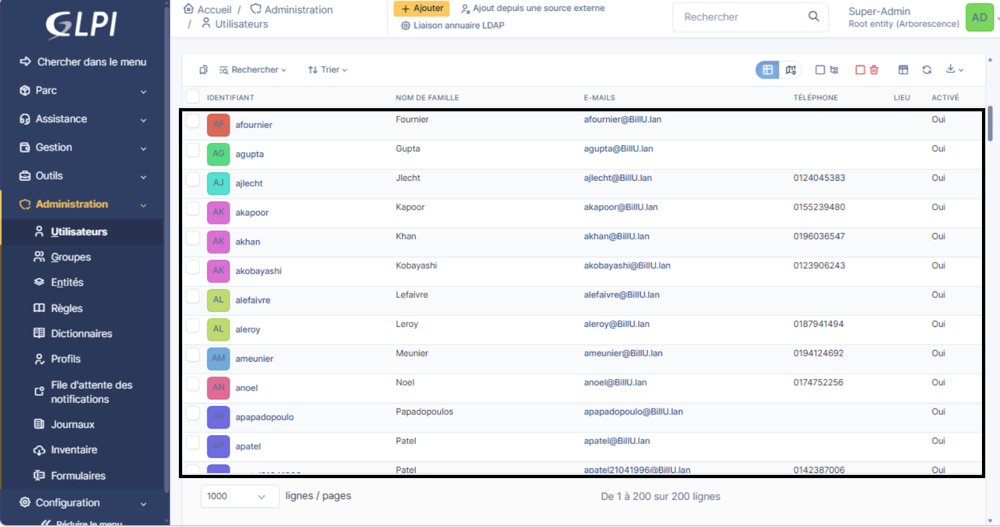

# 4. Installation de GLPI Agent 

- Naviguer dans l'onglet ``Administration`` > ``Inventaire``
- Cocher la case ``Activer l'inventaire``
- Cliquer sur ``Sauvegarder``

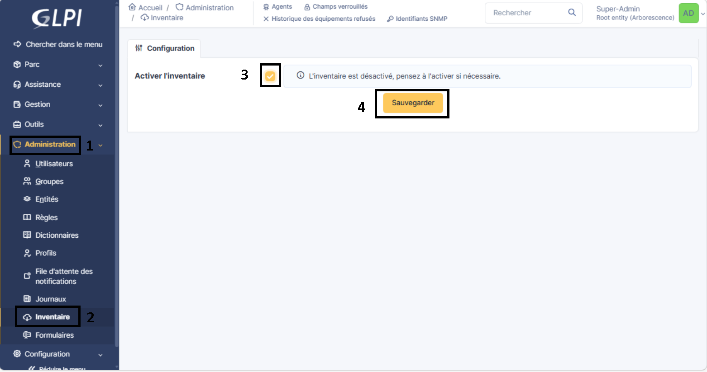
