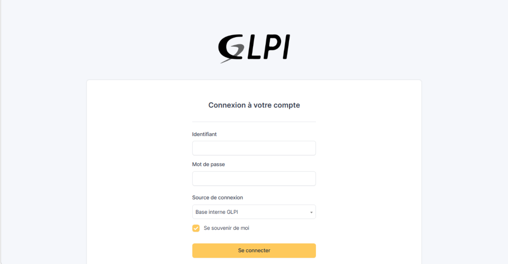

# Sommaire

- [**1. Préparation serveur Debian 13**](#1-préparation-serveur-debian-13)
- [**2. Installation de MariaDB**](#2-installation-de-mariadb)
- [**3. Télécharger GLPI**](#3-télécharger-glpi)
- [**4. Configurer Apache2**](#4-configurer-apache2)
- [**5. Configuration GLPI**](#5-configuration-glpi)
- [**6. Test depuis le navigateur du PC_ADMIN**](#6-test-depuis-le-navigateur-du-pc_admin)
- [**7. Ressources complémentaires**](#7-ressources-complémentaires)

# 1. Préparation serveur Debian 13

## Connexion en root 

```bash
su -
```

## Changement du nom du serveur

```bash
hostnamectl set-hostname BV-130-145
```

## Mise à jour du système

```bash
apt update && apt upgrade -y
```

## Installation des outils 

```bash
apt install -y apache2 mariadb-server php php-curl php-gd php-intl php-mysqli php-xml php-zip php-mbstring php-bz2 php-ldap php-opcache php-cli unzip wget
```

# 2. Installation de MariaDB

## Installation du serveur MariaDB

```bash
apt install mariadb-server mariadb-client -y
```

## Lancement du serveur

```bash
systemctl start mariadb
systemctl enable mariadb
systemctl status mariadb
```

## Configuration MariaDB

```bash
mariadb-secure-installation
```

Une fois cette commande lancé , une console **MariaDB** s'ouvre :

- *Enter root user password or leave blank :* **Appuyer sur entrée**
- *Switch to unix_socket authentication ? :* **N**
- *Change the root password ? :* **N** (si votre mot de passe root est déjà fort)
- *Remove anonymous users ? :* **Y**
- *Disallow root login remotely ? :* **Y** 
- *Remove test database ? :* **Y**
- *Reload privilege tables ? :* **Y** 

## Création de la base de donnée

```bash 
mariadb -u root -p
```

Dans le prompt **MySQL** : 

```bash
CREATE DATABASE glpidb CHARACTER SET utf8mb4 COLLATE utf8mb4_unicode_ci; CREATE USER 'glpiuser'@'localhost' IDENTIFIED BY 'Azerty1*'; GRANT ALL PRIVILEGES ON glpidb.* TO 'glpiuser'@'localhost'; FLUSH PRIVILEGES; EXIT;
```

# 3. Télécharger GLPI 

## Téléchargement depuis GitHub

```bash
cd /tmp wget https://github.com/glpiproject/glpi/releases/download/11.0.7/glpi-11.0.7.tgz 
tar -xzf glpi-11.0.7.tgz -C /var/www/html/ 
chown -R www-data:www-data /var/www/html/glpi/
```

## Créer les dossiers nécessaires 

``` bash
mkdir -p /var/www/html/glpi/files/_cache
mkdir -p /var/www/html/glpi/files/_sessions
mkdir -p /var/www/html/glpi/files/_tmp
mkdir -p /var/www/html/glpi/files/_log
chown -R www-data:www-data /var/www/html/glpi/files/
chmod -R 775 /var/www/html/glpi/files/
```

# 4. Configurer Apache2 

## Lancer Apache2

```bash
systemctl start apache2
systemctl enable apache2
systemctl status apache2
```

## Modification de glpi.conf

```bash
nano /etc/apache2/sites-availables/glpi.conf
```
``` bash
<VirtualHost *:80> 
	ServerName 172.16.10.251 
	DocumentRoot /var/www/html/glpi/public 
	
	<Directory /var/www/html/glpi/public> 
	Require all granted 
	RewriteEngine On 
	RewriteCond %{REQUEST_FILENAME} !-f 
	RewriteRule ^(.*)$ index.php [QSA,L] 
	</Directory> 
	
	ErrorLog /var/log/apache2/glpi-error.log 
	CustomLog /var/log/apache2/glpi-access.log combined 
</VirtualHost>
```

Puis : 

```bash
a2ensite glpi.conf
a2dissite 000-default.conf
a2enmod rewrite
systemctl restart apache2
```

# 5. Configuration GLPI 

Pour configurer **GLPI** , on peut le faire directement en graphique ou en ligne de commande : 

```bash
php /var/www/html/glpi/bin/console db:install --db-host=localhost --db-name=glpidb --db-user=glpiuser --db-password=Azerty1* --no-interaction --allow-superuser -v
```

# 6. Test depuis le navigateur du PC_ADMIN 



Lors de la première connexion, les identifiants sont les suivants : 

- **Compte super-administrateur** : `glpi` / `glpi`
- **Compte administrateur** : `tech` / `tech`
- **Compte normal** : `normal` / `normal`
- **Compte post-only** : `post-only` / `postonly`

# 7. Ressources complémentaires 

- **Documentation officielle** : https://glpi-install.readthedocs.io/
- **Forum communautaire** : https://forum.glpi-project.org/
- **GitHub GLPI** : https://github.com/glpi-project/glpi
- **Plugins GLPI** : https://plugins.glpi-project.org/

