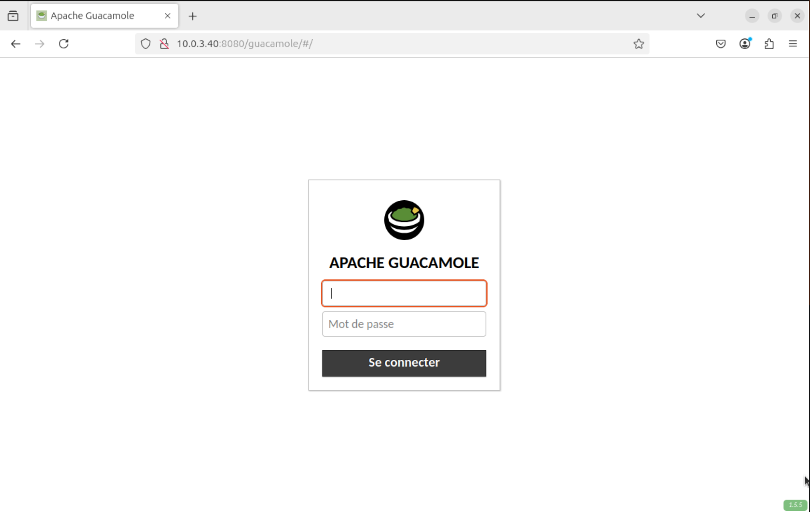

## Installation de Guacamole

L'installation de Guacamole est tres complexe avec de nombreuses dependances.

Afin de reussi nous avons suivi ce tutoriel:

https://www.it-connect.fr/tuto-apache-guacamole-bastion-rdp-ssh-debian/

L'installation se fait en utilisant tomcat9 pour l'interface web ainsi mariadb pour la base de donnée.

L'installation de java est aussi nécessaire.

Une fois les différents debug effectués vous pourrez acceder à l'interface de configuration sur l'adresse:

http://<Adresse IP serveur>:8080/guacamole/

La partie guacamole à la fin est nécessaire afin de bien arriver sur l'interface de connexion.

Le compte guacadmin est crée de base avec un mdp guacadmin qu'il faut changer rapidement au début et supprimer apres avoir crée un autre compte administrateur.
