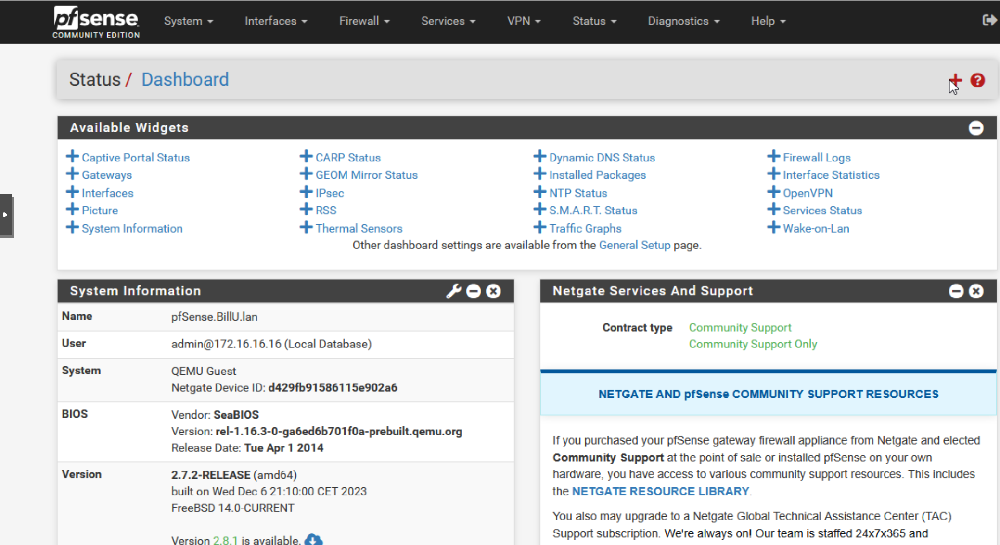
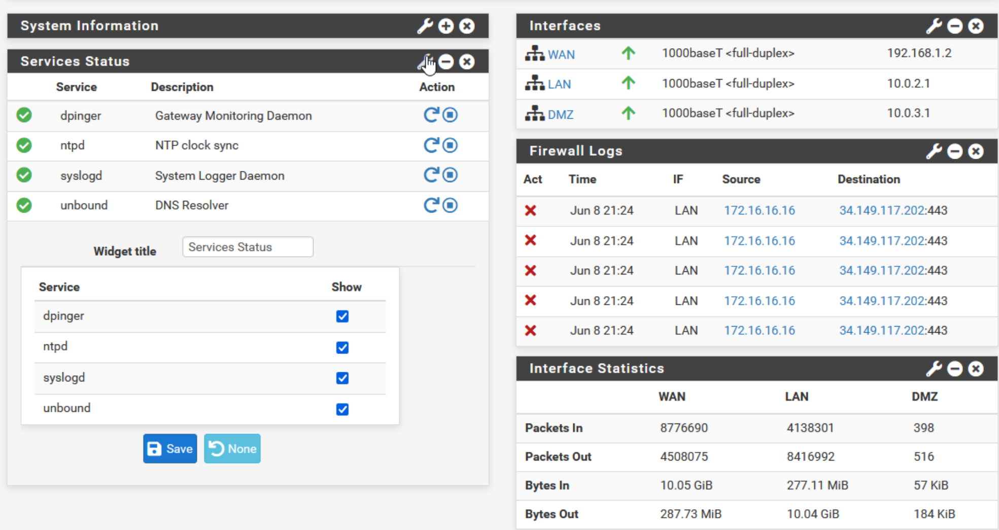
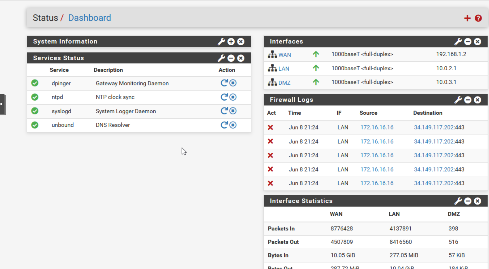
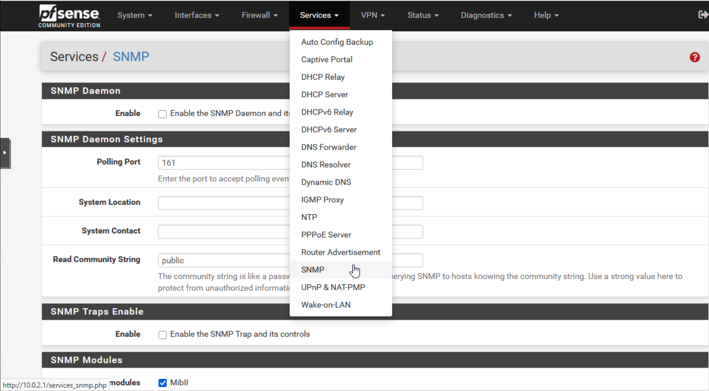

## Paramétrage de la supervision ##

Afin de mieux surveiller l'activité sur notre firewall nous avons choisi de personnaliser notre Dashboad interne grâce aux widgets déjà disponibles dans l'interface de pfsense.

Ajout d'un nouveau widget:

Paramétrage et personnalisation d'un widget:

Rendu du dashboard personnalisé:

Nous avons aussi activé le service SNMP afin de pouvoir plus tard activer la supervision à distance grâce à des outils tels que ZABBIX:

