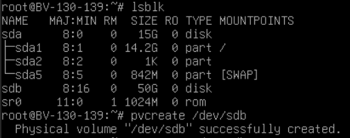
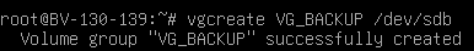
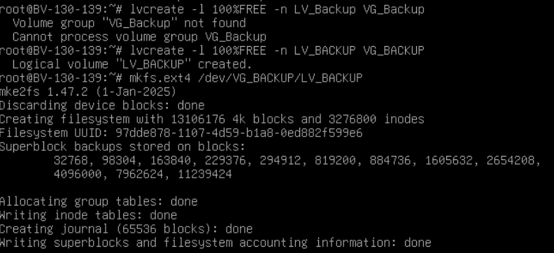
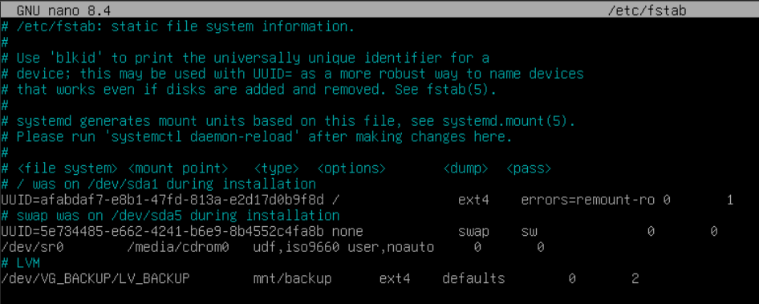
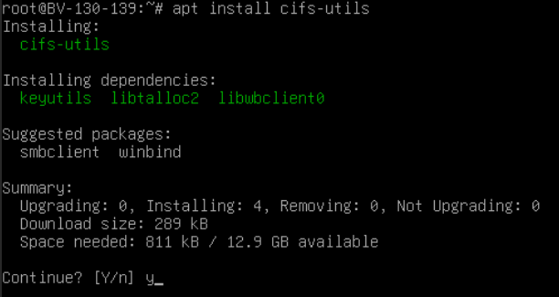
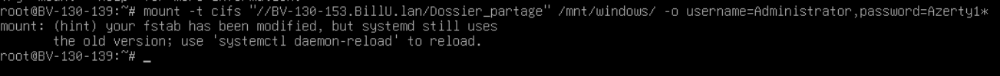
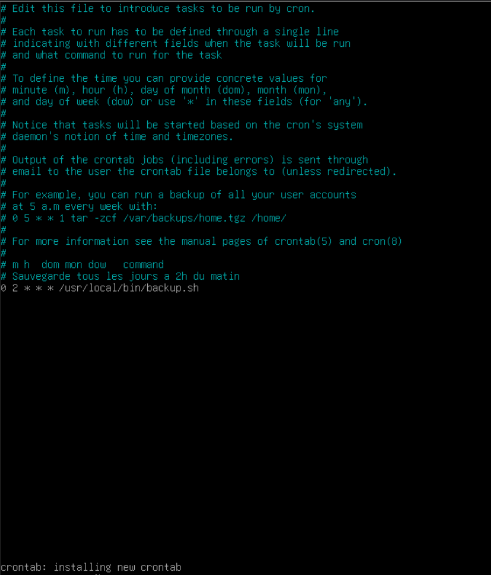
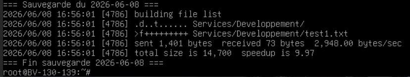

# Sommaire
- [**1. Configuration du LVM**](#1-configuration-du-lvm)
  - [**1.1 Création du physical volume**](#11-création-du-physical-volume)
  - [**1.2 Création du Volume Group**](#12-création-du-volume-group)
  - [**1.3 Création du Logical Volume**](#13-création-du-logical-volume)
  - [**1.4 Formatage et montage**](#14-formatage-et-montage)
  - [**1.5 Montage automatique au démarrage**](#15-montage-automatique-au-démarrage)
- [**2. Montage du partage Windows**](#2-montage-du-partage-windows)
  - [**2.1 Installation de cifs-utils**](#21-installation-de-cifs-utils)
  - [**2.2 Création du point de montage**](#22-création-du-point-de-montage)
  - [**2.3 Montage du partage**](#23-montage-du-partage)
  - [**2.4 Montage automatique au démarrage**](#24-montage-automatique-au-démarrage)
- [**3. Script de sauvegarde rsync**](#3-script-de-sauvegarde-rsync)
  - [**3.1 Création du script**](#31-création-du-script)
  - [**3.2 Rendre le script exécutable**](#32-rendre-le-script-exécutable)
  - [**3.3 Test du script**](#33-test-du-script)
- [**4. Planification avec Cron**](#4-planification-avec-cron)
  - [**4.1 Configurer le cron**](#41-configurer-le-cron)
  - [**4.2 Vérifier le cron**](#42-vérifier-le-cron)

---

# 1. Configuration du LVM

## 1.1 Création du Physical Volume

- Identifier le disque dédié à la sauvegarde :

```bash
lsblk
```

- Créer le Physical Volume sur le disque `/dev/sdb` :

```bash
pvcreate /dev/sdb
```


## 1.2 Création du Volume Group

- Créer le Volume Group `VG_BACKUP` :

```bash
vgcreate VG_BACKUP /dev/sdb
```



## 1.3 Création du Logical Volume

- Créer le Logical Volume `LV_BACKUP` en utilisant tout l'espace disponible :

```bash
lvcreate -l 100%FREE -n LV_BACKUP VG_BACKUP
```


## 1.4 Formatage et montage

- Formater le Logical Volume en ext4 :

```bash
mkfs.ext4 /dev/VG_BACKUP/LV_BACKUP
```

- Créer le point de montage et monter le volume :

```bash
mkdir -p /mnt/backup
mount /dev/VG_BACKUP/LV_BACKUP /mnt/backup
```

- Vérifier que le volume est bien monté :

```bash
df -h /mnt/backup
```

- Résultat attendu :

```
Filesystem                        Size  Used Avail Use% Mounted on
/dev/mapper/VG_BACKUP-LV_BACKUP   50G   24K   47G   1% /mnt/backup
```

## 1.5 Montage automatique au démarrage

- Ajouter la ligne suivante dans `/etc/fstab` :

```bash
echo '/dev/VG_BACKUP/LV_BACKUP /mnt/backup ext4 defaults 0 2' >> /etc/fstab
```


---

# 2. Montage du partage Windows

## 2.1 Installation de cifs-utils

- Installer le paquet nécessaire au montage CIFS :

```bash
apt install cifs-utils -y
```



## 2.2 Création du point de montage

- Créer le répertoire qui accueillera le partage Windows :

```bash
mkdir -p /mnt/windows
```

## 2.3 Montage du partage

- Monter le partage Windows `Dossier_partage` :

```bash
mount -t cifs "//BV-130-153.BillU.lan/Dossier_partage" /mnt/windows -o username=Administrator,password='Azerty1*',uid=0,gid=0,file_mode=0777,dir_mode=0777
```


- Vérifier que les dossiers sont bien accessibles :

```bash
ls /mnt/windows
```

- Résultat attendu :

```
Departement  Services  Utilisateurs
```

## 2.4 Montage automatique au démarrage

- Ajouter la ligne suivante dans `/etc/fstab` :

```
//BV-130-153.BillU.lan/Dossier_partage /mnt/windows cifs username=Administrator,password='Azerty1*',uid=0,gid=0,file_mode=0777,dir_mode=0777 0 0
```

---

# 3. Script de sauvegarde rsync

### 3.1 Création du script

- Créer le fichier `/usr/local/bin/backup.sh` :

```bash
nano /usr/local/bin/backup.sh
```

- Contenu du script :

```bash
#!/bin/bash

DATE=$(date +%Y-%m-%d)
LOG="/var/log/backup.log"
SRC="/mnt/windows/"
DEST="/mnt/backup/"

echo "=== Sauvegarde du $DATE ===" >> $LOG

rsync -avz --delete \
  --exclude='Utilisateurs/' \
  $SRC $DEST \
  --log-file=$LOG

echo "=== Fin sauvegarde $DATE ===" >> $LOG
```

## 3.2 Rendre le script exécutable

```bash
chmod +x /usr/local/bin/backup.sh
```

## 3.3 Test du script

- Lancer le script manuellement pour vérifier son bon fonctionnement :

```bash
/usr/local/bin/backup.sh
```

- Vérifier le contenu sauvegardé :

```bash
ls /mnt/backup/
```

- Résultat attendu :

```
Departement  Services
```

- Vérifier le log de sauvegarde :

```bash
cat /var/log/backup.log
```

---

# 4. Planification avec Cron

## 4.1 Configurer le cron

- Ouvrir l'éditeur cron :

```bash
crontab -e
```

- Ajouter la ligne suivante à la fin du fichier pour une sauvegarde tous les jours à 2h00 :

```
0 2 * * * /usr/local/bin/backup.sh
```


- Sauvegarder avec `Ctrl+X` → `Y` → `Entrée`

## 4.2 Vérifier le cron

- Vérifier que la tâche est bien enregistrée :

```bash
crontab -l
```

- Résultat attendu :

```
0 2 * * * /usr/local/bin/backup.sh
```

- Vérifier que le service cron est bien actif :

```bash
systemctl status cron
```

- Consulter les logs d'exécution du cron :

```bash
grep CRON /var/log/syslog
```


