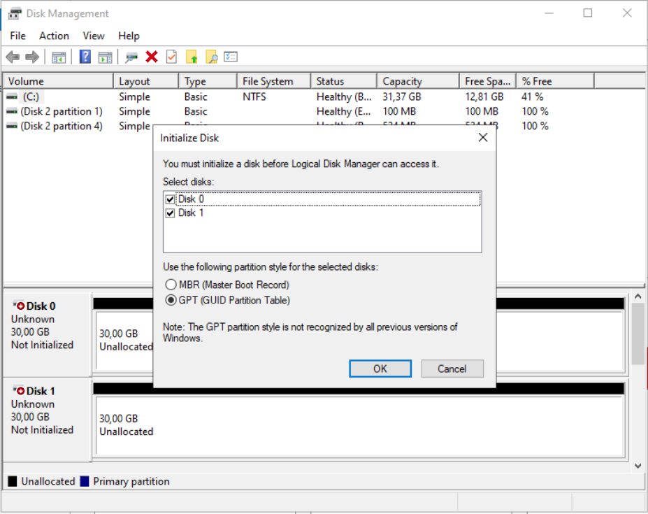
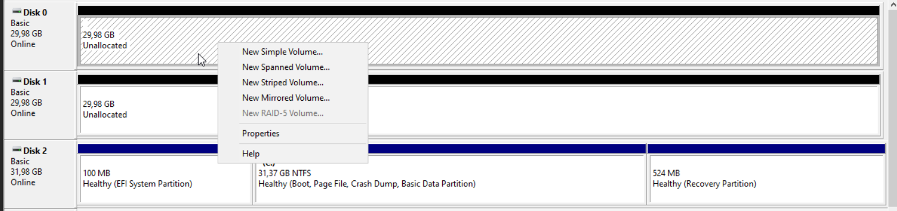
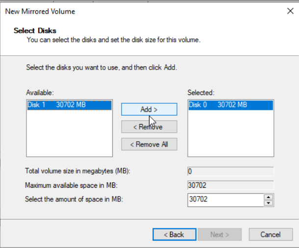
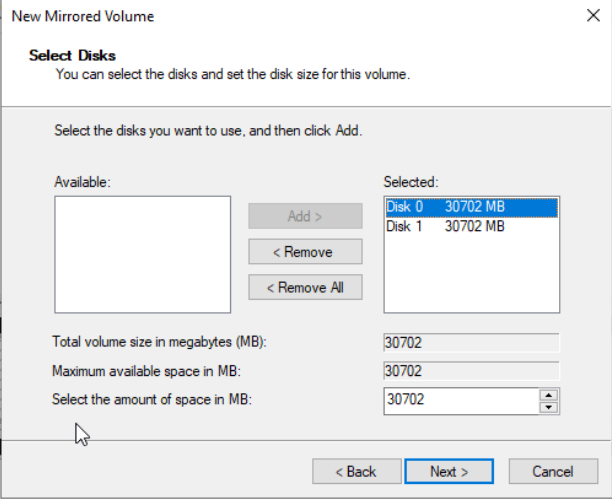
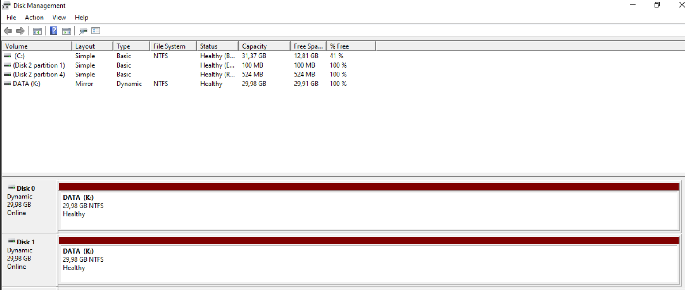

# Sommaire

- [**1. Création du volume miroir RAID1**](#1-création-du-volume-miroir-raid1)
   - [**1.1 Initialisation des disques**](#11-initialisation-des-disques)
   - [**1.2 Lancer l'assistant New Mirrored Volume**](#12-lancer-lassistant-new-mirrored-volume)
   - [**1.3 Sélection des disques**](#13-sélection-des-disques)
   - [**1.4 Attribution de la lettre de lecteur**](#14-attribution-de-la-lettre-de-lecteur)
   - [**1.5 Formatage du volume**](#15-formatage-du-volume)
- [**2. Vérification du RAID1**](#2-vérification-du-raid1)
   - [**2.1 Vérifier l'état du volume miroir**](#21-vérifier-létat-du-volume-miroir)

---

# 1. Création du volume miroir RAID1

## 1.1 Initialisation des disques

- Ouvrir le `Gestionnaire de disques` :
   - Clic droit sur le menu `Démarrer`
   - Cliquer sur `Gestion des disques`

- Une fenêtre `Initialize Disk` s'ouvre automatiquement
- Les deux nouveaux disques apparaissent :
   - `Disk 0` — 30,00 GB — Not Initialized
   - `Disk 1` — 30,00 GB — Not Initialized
 

- Sélectionner les **deux disques** (`Disk 0` et `Disk 1`)
- Choisir le style de partition `GPT (GUID Partition Table)`
- Cliquer sur `OK`

- Résultat : les deux disques passent en état **Online** avec l'espace affiché en `Unallocated`

## 1.2 Lancer l'assistant New Mirrored Volume

- Clic droit sur l'espace `Unallocated` de `Disk 0`
- Cliquer sur `New Mirrored Volume...`

- L'assistant `New Mirrored Volume` s'ouvre
- Cliquer sur `Next`

## 1.3 Sélection des disques

- Dans la fenêtre `Select Disks` :
   - `Disk 0` est déjà dans la colonne `Selected` (30702 MB)
   - Sélectionner `Disk 1` dans la colonne `Available`

   - Cliquer sur `Add >`

- `Disk 1` passe dans la colonne `Selected`

- Résultat :

| Paramètre                      | Valeur   |
|-------------------------------|----------|
| Total volume size in MB       | 30702    |
| Maximum available space in MB | 30702    |
| Select the amount of space in MB | 30702 |

- Cliquer sur `Next`

## 1.4 Attribution de la lettre de lecteur

- Sélectionner `Assign the following drive letter`
- Choisir la lettre `K:`
- Cliquer sur `Next`

## 1.5 Formatage du volume

- Sélectionner `Format this volume with the following settings` :
   - File system : `NTFS`
   - Allocation unit size : `Default`
   - Volume label : `DATA`
- Cocher `Perform a quick format`
- Cliquer sur `Next` puis `Finish`

- Un message de confirmation indique que les disques vont être convertis en **disques dynamiques**
- Cliquer sur `Yes` pour confirmer

---

# 2. Vérification du RAID1

## 2.1 Vérifier l'état du volume miroir

- Dans le `Gestionnaire de disques`, vérifier que les deux disques affichent bien :

| Volume   | Layout | Type    | File System | Status  | Capacity |
|----------|--------|---------|-------------|---------|----------|
| DATA (K:)| Mirror | Dynamic | NTFS        | Healthy | 29,98 GB |

- Dans la vue graphique en bas :
   - `Disk 0` — Dynamic — 29,98 GB — Online → `DATA (K:)` Healthy
   - `Disk 1` — Dynamic — 29,98 GB — Online → `DATA (K:)` Healthy
 

- Ouvrir l'`Explorateur de fichiers`
- Le lecteur `K:` (DATA) doit apparaître dans `Ce PC`
