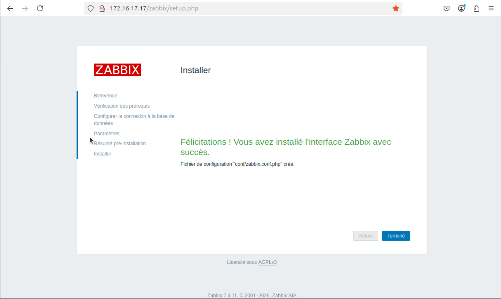
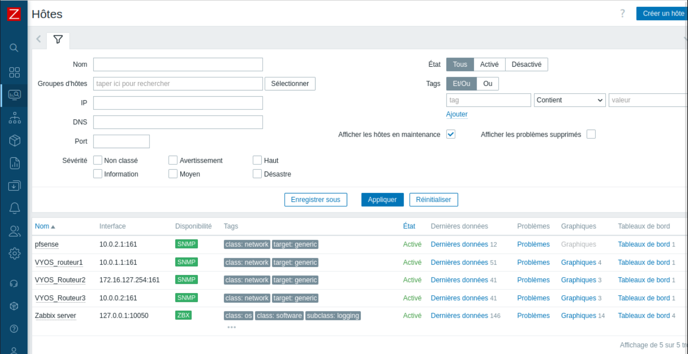
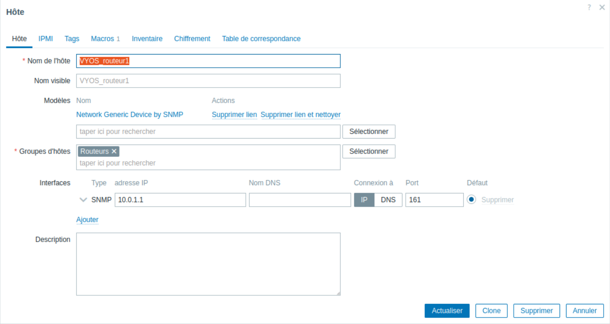
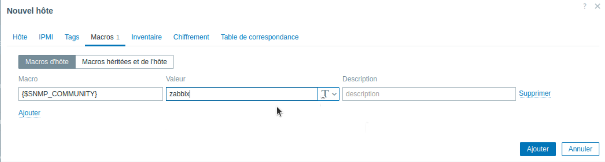
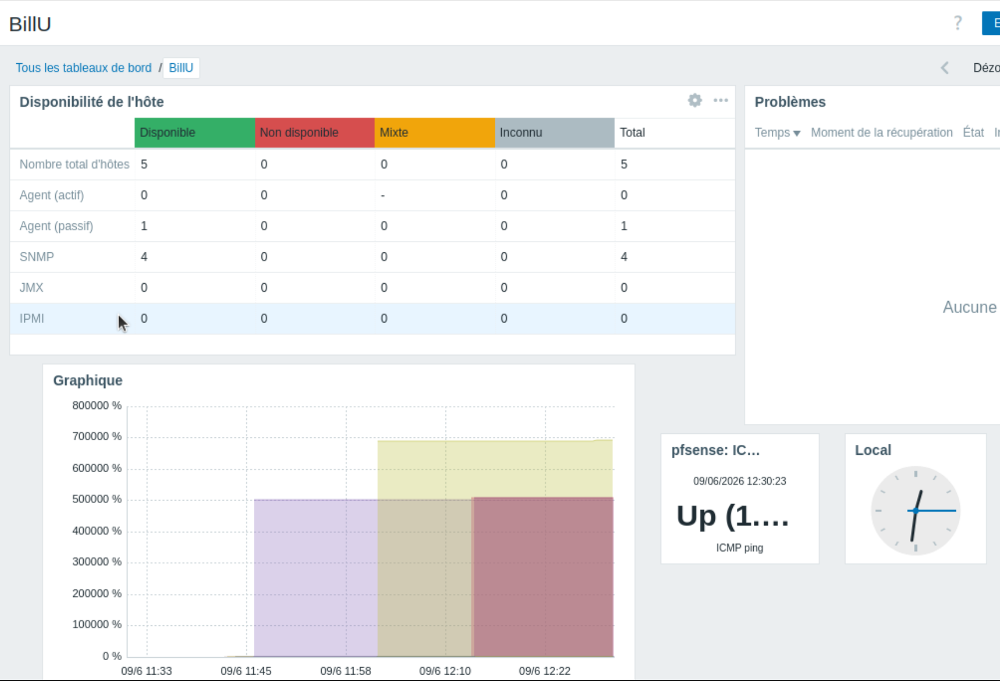

## Configuration du Serveur Zabbix pour la Supervision ##

Au lancement de l'interface Web pour la première fois il y a une première phase de configuration:

Il suffit de suivre l'assistant de configuration jusqu'à la fin afin de configurer correctement le serveur.

Une fois loggé correctement nous allons commencer par créer de nouveaux hôtes qui vont venir s'ajouter sur l'interface de supervision:

Pour cela il suffit d'aller dans hôte puis cliquer sur créer un hôte.

Puis il faut renseigner le nom de l'hote, son groupe ainsi que le modèle de communication qu'il utilise (ici le network generic snmp):

Puis dans la partie Macro il faut renseigner la macro avec la syntaxe suivante:

Enfin dans la partie Dashboard on peut créer un tableau personnalisé avec les widgets que l'on veut:

